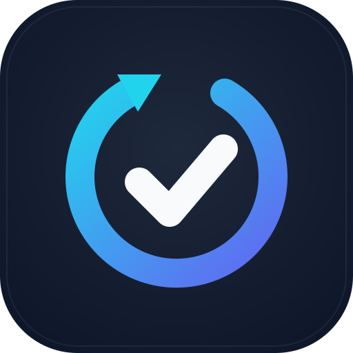
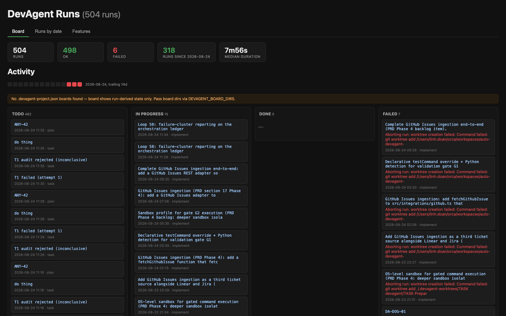
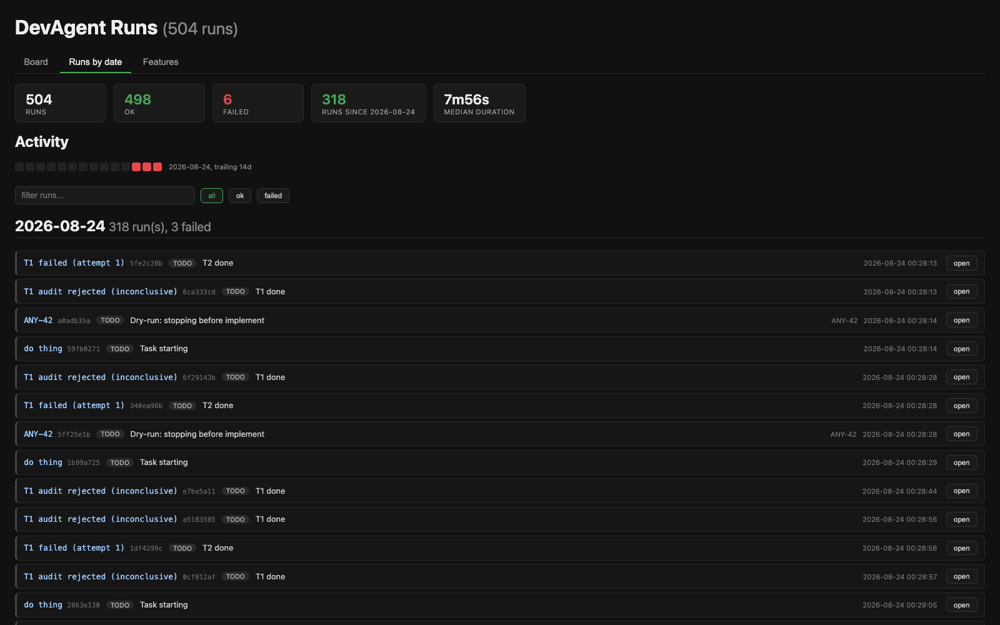
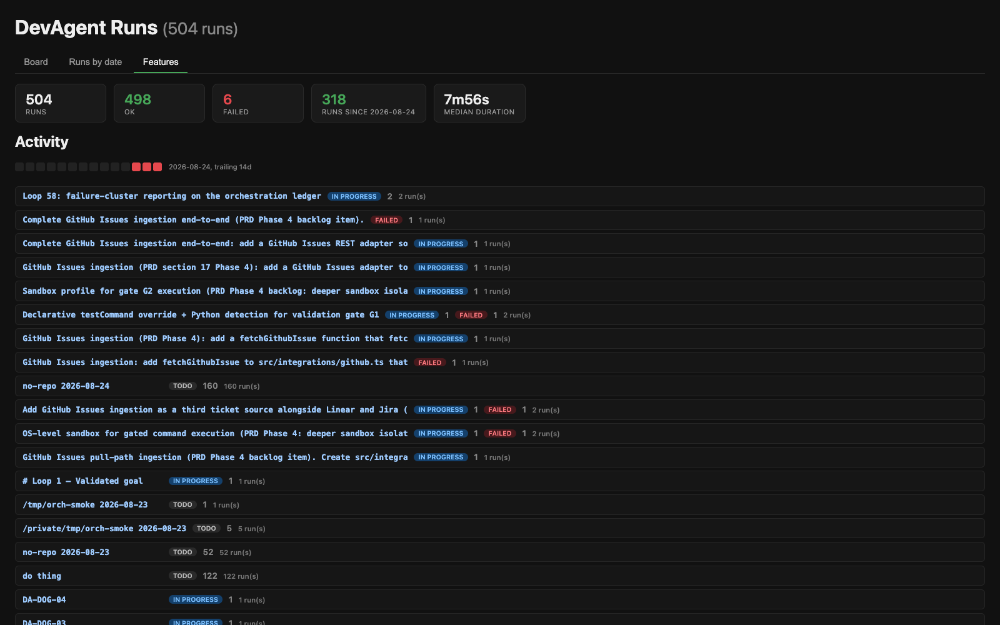

<div align="center">



# DevAgent

**The Autonomous Backend Delivery Agent — ticket in, tested pull request out.**

[](https://github.com/FreePeak/devagent/actions/workflows/ci.yml)
[](LICENSE)
[](package.json)
[](CONTRIBUTING.md)

</div>

---

DevAgent integrates with your issue tracker (Linear in v1; Jira, GitHub Issues planned), parses backend specs, drafts database migrations, writes production-grade API code using headless coding-agent CLIs (Claude Code, OpenCode) as execution workers, validates every change inside sandboxed Docker containers, and delivers tested Pull Requests with auto-generated documentation for frontend teams.

```bash
# Process a ticket headlessly
devagent run --ticket LINEAR-204 --repo ./backend-service --auto-pr

# Interactive mode with mid-step human approvals
devagent run --ticket JIRA-8821 --interactive
```

## Dashboard

Every orchestration run is observable. `devagent dashboard` renders a static
status board from run logs — kanban board, per-date run analytics, and feature
progress across projects:

| Board | Runs by date | Features |
|---|---|---|
|  |  |  |


## Why DevAgent

- **Set-and-forget backend ops** — assign a ticket to `@devagent` and get back a green, tested PR. A virtual team member, not an IDE extension.
- **Specialized domain intelligence** — general AI coders break database integrity and ignore async race conditions. DevAgent explicitly validates migration scripts, foreign-key safety, lock-risk patterns, and event-queue logic before anything leaves the machine.
- **Closed-loop testing** — nothing is submitted because it "looks right". Every change is verified against the real test suite and migrated schema inside an isolated container first.
- **Multi-worker fan-out** — the same ticket can run through Claude Code and OpenCode in parallel isolated worktrees; the validated winner becomes the PR.

## Orchestration

Beyond single tickets, `devagent orchestrate` decomposes a product goal into a
dependency DAG of small tasks and runs executors over it in bounded parallel
waves (LongHorizon-Harness pattern: plan -> execute -> audit -> checkpoint).

```bash
# Review the plan before spending executor tokens
devagent orchestrate --goal "Add CSV export to the orders API" --repo ./backend --plan-only

# Execute: planner decomposes, executors implement in worktrees, auditor verifies
devagent orchestrate --goal "Add CSV export to the orders API" --repo ./backend

# Resume a persisted board (.devagent-project.json); answer a paused task
devagent orchestrate --goal "" --resume --answer T3="use the analytics replica"
```

Key properties:

- **Evidence-gated completion** — an executor's success only moves a task to
  `untrusted`; it becomes `done` solely on an independent read-only audit
  verdict with clean integrity (workspace mutation during an audit voids the
  verdict). `--no-audit` restores executor-gates-only trust.
- **Role tiering** — planner, executor, and auditor are separate workers;
  point the auditor at a cheaper CLI (`--auditor opencode`) since auditing is
  the dominant token cost.
- **Targeted retries** — failed audits externalize unmet criteria as evidence
  gaps; the retry contract targets the gap instead of redoing blind work.
- **Recovery contracts** — when retries exhaust, the planner rewrites the
  contract around recorded failures (`--max-recoveries`, default 1) before a
  failure goes terminal.
- **Human in the loop** — auditors may return `ask`; the branch pauses until
  you answer via CLI (`--answer <id>=<text>`), MCP (`devagent_answer` tool,
  questions surfaced by `devagent_board`), or HTTP
  (`POST /api/answer` on `serve`, Bearer `DEVAGENT_ANSWER_TOKEN`).
- **Merge-back** — completed branches integrate topologically onto the base
  branch with gates re-run per merge.
- **Worker sandboxing** — agent-CLI workers never inherit secret-shaped env
  vars (`GITHUB_TOKEN`, cloud credentials, ...); an allowlist keeps only what
  the CLIs need (extend with `DEVAGENT_WORKER_ENV_ALLOWLIST`). On macOS,
  `DEVAGENT_SANDBOX=seatbelt` additionally runs workers under `sandbox-exec`
  with writes confined to the worktree and temp dirs, and
  `DEVAGENT_SANDBOX_NETWORK=deny` blocks all socket creation for fully
  offline worker runs. For tighter egress control,
  `DEVAGENT_SANDBOX_NETWORK=allowlist` denies all sockets except the resolved
  endpoints in `DEVAGENT_SANDBOX_NETWORK_ALLOWLIST` (comma-separated
  `host[:port]`, default port 443), e.g.
  `DEVAGENT_SANDBOX_NETWORK_ALLOWLIST="api.anthropic.com, registry.npmjs.org"`.
  Git, Docker, and test runner processes are unaffected.

## Runtime visibility

### Herdr worker panes

By default workers run headless and are only observable via run logs. Opt in
to running every worker launch inside a herdr pane instead — visible live,
reattachable, disconnect-proof:

- `herdr.enabled: true` in `devagent.json`, or env override `DEVAGENT_HERDR=1` (`=0` forces off)
- Workers open in a named session — attach with `herdr session attach devagent` to watch them work
- `DEVAGENT_HERDR_KEEP_PANES=1` keeps completed panes around for inspection

See [docs/HERDR.md](docs/HERDR.md) for the full behavior contract.

### LaunchAgent control

| Make target | Effect |
|---|---|
| `make agents-status` | Show loaded launchctl agents, disabled registry, running processes |
| `make agents-on` | Enable and bootstrap all repo plists already installed in `~/Library/LaunchAgents` |
| `make agents-off` | Boot out and disable all agent labels, then kill running loops |
| `make agents-install` | Render `launchagents/*.plist` into `~/Library/LaunchAgents`, lint, load |
| `make agents-uninstall` | Boot out, disable, and delete installed plists (repo copies untouched) |
| `make kill` | Kill loop scripts/workers and watchdog daemons; never touches launchctl state |

## Documentation

| Document | Format | Description |
|---|---|---|
| [Product Requirements Document](docs/PRD.md) | Markdown | Full PRD: problem, personas, requirements (FR/NFR), architecture, pipeline, validation gates, CLI spec, integrations, metrics, risks, roadmap |
| [Product Requirements Document](docs/PRD.html) | HTML | Same document, styled single-file HTML for sharing |
| [War Room mode](docs/WAR-ROOM.md) | Markdown | Goal-driven infinity loop: abstract idea → research → spec-until-clear → implement-until-evidenced. Built for new products and hackathons (`npm run warroom`) |
| [cc-guard: auto-resume for headless sessions](docs/cc-guard.md) | Markdown | Supervisor that restarts Claude Code sessions killed by API failures ("Connection lost mid-response") via `devagent guard` |
| [LongHorizon-Harness analysis](docs/research/longhorizon-harness.md) | Markdown | Research backing evidence-gated orchestration: MEA loop, audit economics, recovery strategy (arXiv:2608.01964) |
| [Scout + Factory (24/7)](docs/SCOUT.md) | Markdown | 24/7 scout (opencode research → PRD → queue) + Orca workers (queue → PR → auto-merge → self-update) on macOS |
| [Scout + Factory PRD](docs/SCOUT-CREATE-PRD.md) | Markdown | Factory requirements: queue, scout daemon, `devagent create`, LaunchAgent, auto-merge, self-update |
| [Self-Build Loop](docs/SELF-BUILD-LOOP.md) | Markdown | Infinity loop driver (`scripts/selfbuild-loop.sh`) + Orca automation modes |
| [Git cleanup of merged MRs/PRs](docs/cleanup-merged.md) | Markdown | `scripts/git-cleanup-merged.sh`: delete local branches + worktrees whose GitLab MR / GitHub PR was merged, across all nested repos in `~/work` (dry-run default, launchd automation) |
| [Herdr runtime support](docs/HERDR.md) | Markdown | Run worker launches inside herdr panes (persistent terminal workspace manager): visible, reattachable, disconnect-proof; opt-in via `herdr.enabled` or `DEVAGENT_HERDR=1` |

Research sources backing the PRD are cited inline and collected in the [research appendix](docs/PRD.md#19-research-appendix).

## Status

v0.4.0 — factory (scout + Orca workers) landed (2026-08-25):

- **Factory bootstrap**: `devagent create --repo . --scout --workers N [--auto-merge] [--self-update]` creates `.devagent/queue` + `.devagent/prds`, merges `devagent.json`, registers repo with `orca`, provisions Orca worktrees, installs scout LaunchAgent. `--dry-run` prints plan.
- **Scout (24/7 researcher)**: `devagent scout [--once] [--dry-run] [--interval <min>] [--worker opencode|claude-code]` researches `docs/PRD.md §4+§17` + ledger + lessons, writes markdown PRD to `.devagent/prds/<id>.md` and task to `.devagent/queue/<id>.json`; heartbeat at `.devagent/scout.heartbeat.json`, `devagent scout-status` surfaces it. Live mode uses `opencode run --format json`; unparseable output or missing binary falls back deterministically so the queue never starves. `maxQueued` caps depth.
- **Queue**: `devagent queue list [--status] [--json]`, `queue show <id>`; filesystem store `.devagent/queue/*.json`, no DB.
- **Workers**: `devagent consume --auto-pr [--auto-merge]` claims oldest `pending` task, creates `.devagent-worktrees/<id>` worktree, runs pipeline (synthetic ticket, no tracker creds), validates G1/G3/G4, pushes `devagent/<id>` and opens PR via `gh`, optionally `gh pr merge --auto --squash` (see [SCOUT.md](docs/SCOUT.md)).
- **Orca fleet provisioner**: `src/integrations/orca.ts` now exposes `ensureOrcaRepo`, `createOrcaWorktree`, `listOrcaWorktrees` (best-effort, degrades when Orca absent); `dropOrcaWorkspace` already existed.
- **Auto-merge**: `src/integrations/github.ts: autoMergePr(repo, prRef)` via `gh pr merge --auto --squash`; controlled by `config.autoMerge` / `create --auto-merge`.
- **Self-update**: `src/self-update.ts: runSelfUpdate` + `scripts/self-update.sh` — `git pull --ff-only` + `npm ci|install` + `build` + `launchctl kickstart com.devagent.scout`, guarded on dirty worktree, secrets redacted in error details.
- **Persistence (macOS)**: LaunchAgent plist `~/Library/LaunchAgents/com.devagent.scout.plist` running `node dist/src/cli.js scout --interval <n>` with `KeepAlive` + `RunAtLoad`, `plutil -lint` clean; `scripts/install-scout-launchagent.sh [--validate|--uninstall]`.
- 314 tests green (was 276) incl. `test/queue.test.ts`, `test/scout.test.ts`, `test/create-consume.test.ts`, `test/self-update.test.ts`.

v0.3.0 — v1 complete, fleet + observability landed (2026-08); evidence-gated
orchestration landed 2026-08-24 (loops 40-46):

- **CLI**: `devagent run|serve|validate|log|status|dashboard|fleet|config|orchestrate|project|mcp`
- **Workers**: headless Claude Code (`claude -p`) and OpenCode (`opencode run`); fan-out mode (`--worker both`) runs parallel legs and picks the test-passing winner; retries carry gate evidence back as repair prompts
- **Gates**: G1 repo-native tests, G2 up/down migration apply (compose; honest skips without Docker), G3 static migration analysis (8 rules), G4 concurrency review scoped to the run's own diff
- **Auto-cleanup**: after every `run`/`task`/`fleet` run the worktree is finalized per `--cleanup auto|keep|always` (default `auto`: on success uncommitted output is snapshotted to the run branch, then the tree is removed; failed runs are preserved for debugging). `--drop-orca-workspace` additionally removes an enclosing Orca-managed workspace via orca-cli. Applies identically to Claude Code and OpenCode workers
- **Fleet**: `devagent fleet --ticket A --ticket B --repo api=/repos/api ...` runs the ticket×repo matrix over a bounded pool with per-job failure isolation
- **Triggers**: CLI plus webhook server (`serve`) — HMAC verification, delivery dedup, latest-wins per ticket via lock registry
- **Delivery**: branch push + gh PR with plan, changed-file evidence, acceptance criteria (`--auto-pr`)
- **Resilience**: Linear 429 handling honors Retry-After with jittered backoff
- **Orchestration**: goal -> DAG -> audited parallel execution with recovery
  contracts, human-in-the-loop ask/answer (CLI/MCP/HTTP), plan-only preview,
  topological merge-back (see [Orchestration](#orchestration))
- **MCP**: stdio server (`devagent mcp`) exposing dispatch/status/log/board/answer tools
- **Observability**: JSONL run logs, `status`, `log`, and a static HTML `dashboard`
- 250+ tests green incl. end-to-end over real git fixtures

Deferred to later: deeper sandbox isolation beyond compose conventions, remote execution. See the [roadmap](docs/PRD.md#17-roadmap).

## Factory (24/7 scout + Orca workers)

```bash
# Bootstrap once (idempotent): scout on LaunchAgent + Orca workers + queue
devagent create --repo . --scout --workers 3 --auto-merge --self-update
devagent create --repo . --scout --workers 2 --dry-run   # preview without mutating

# Scout
devagent scout --once --dry-run                            # one deterministic cycle (no LLM)
devagent scout --once                                      # one live cycle (opencode)
devagent scout --interval 30                               # daemon: loop every 30m until SIGINT
devagent scout-status                                      # heartbeat + queue depth

# Queue
devagent queue list --status pending
devagent queue show SCOUT-20260825-xxxx

# Workers: claim + implement + test + PR (+ auto-merge)
devagent consume --auto-pr --auto-merge
```

See [docs/SCOUT.md](docs/SCOUT.md) for the full factory runbook (LaunchAgent management, self-update, Orca provisioner).

## Development

```bash
npm install
npm run typecheck && npm test   # verify
npm run dev -- --help           # command overview
npm run dev -- config           # smoke-test the CLI
```

Credentials via environment only: `LINEAR_API_KEY`, `GITHUB_TOKEN`, `LINEAR_WEBHOOK_SECRET` (for `serve`). See [PRD section 12](docs/PRD.md#12-cli-specification) for the full CLI contract.

## Contributing

Contributions welcome — see [CONTRIBUTING.md](CONTRIBUTING.md) for setup and
conventions. For security issues, see [SECURITY.md](SECURITY.md); please do
not open public issues for vulnerabilities.

## License

[MIT](LICENSE) © FreePeak and DevAgent contributors.
