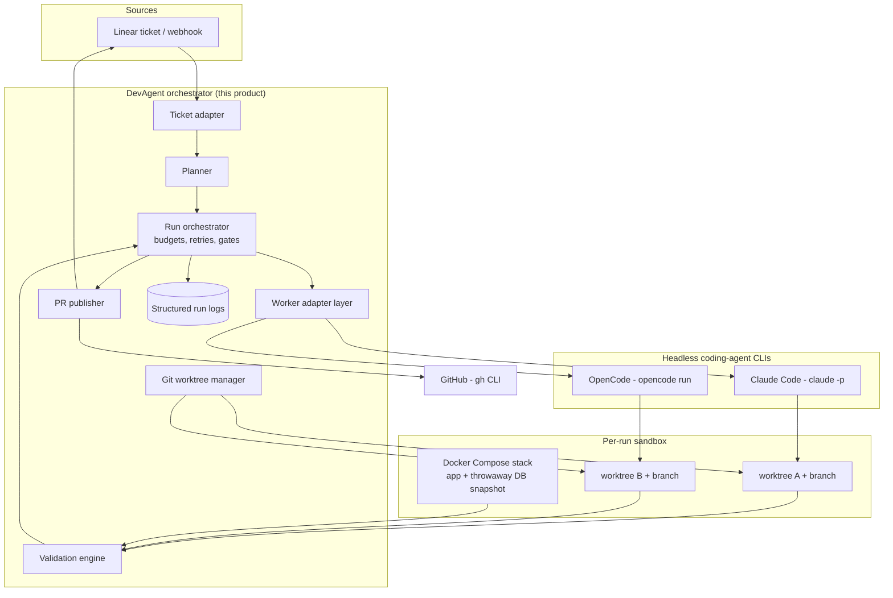
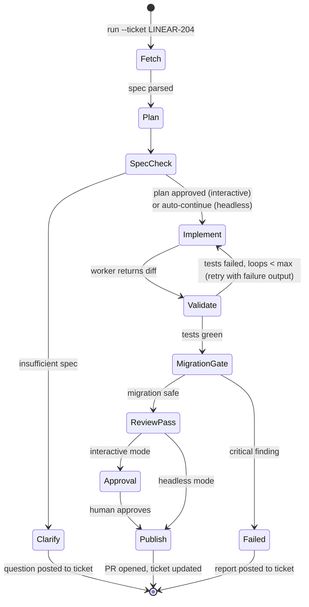

# DevAgent — Product Requirements Document

> The Autonomous Backend Delivery Agent for modern engineering teams.
>
> Status: Draft v0.1 · 2026-08-22 · Owner: linh.doan

---

## Table of Contents

1. [Executive Summary](#1-executive-summary)
2. [Problem Statement](#2-problem-statement)
3. [Product Vision and Positioning](#3-product-vision-and-positioning)
4. [Competitive Landscape](#4-competitive-landscape)
5. [Target Users and Personas](#5-target-users-and-personas)
6. [Scope](#6-scope)
7. [Functional Requirements](#7-functional-requirements)
8. [System Architecture](#8-system-architecture)
9. [Worker Adapter Layer](#9-worker-adapter-layer)
10. [Delivery Pipeline](#10-delivery-pipeline)
11. [Validation Gates (Domain Intelligence)](#11-validation-gates-domain-intelligence)
12. [CLI Specification](#12-cli-specification)
13. [Integrations](#13-integrations)
14. [Non-Functional Requirements](#14-non-functional-requirements)
15. [Metrics and Success Criteria](#15-metrics-and-success-criteria)
16. [Risks and Mitigations](#16-risks-and-mitigations)
17. [Roadmap](#17-roadmap)
18. [Open Questions](#18-open-questions)
19. [Research Appendix](#19-research-appendix)
20. [Product Direction Addendum: Grok Bot, xAI Integration, Cross-Platform Control App](#20-product-direction-addendum-grok-bot-xai-integration-cross-platform-control-app)
21. [Product Direction Addendum: Simplicity First (FR-SIMPLE)](#21-product-direction-addendum-simplicity-first-fr-simple)

---

## 1. Executive Summary

DevAgent is a vertical autonomous agent that converts backend tickets into tested, reviewed Pull Requests with minimal human involvement. A user assigns a ticket to `@devagent` in Linear or Jira; DevAgent parses the spec, plans the work, drafts database migrations and API code using headless coding-agent CLIs (Claude Code, OpenCode) as execution workers, validates the result in sandboxed Docker containers, and opens a Pull Request with auto-generated documentation for frontend teams.

DevAgent is **not** a general-purpose coding tool. It is a delivery pipeline product: the value is in the closed loop (ticket → plan → code → validate → PR) and in backend-specific domain intelligence that general coding agents lack — migration safety validation, foreign-key integrity checks, and async/race-condition review.

## 2. Problem Statement

Backend ticket delivery has three chronic failure modes:

1. **Latency**: small-to-medium backend tickets (new endpoint, schema tweak, queue consumer) wait days in backlog even though they are well-specified.
2. **Correctness risk from automation**: general AI coders break database integrity — destructive migrations, missing foreign-key constraints, lock-timeout-inducing index builds on large tables — and ignore async race conditions because they never execute what they write against real data.
3. **Review burden**: PRs from AI tools often "look right" but are unverified, shifting cost onto human reviewers who must mentally simulate behavior.

DevAgent addresses all three by owning delivery end to end and refusing to submit anything it has not proven green in an isolated environment.

## 3. Product Vision and Positioning

### 3.1 Positioning statement

| Dimension | General coding tool (Cursor, Copilot IDE) | DevAgent |
|---|---|---|
| User role | Human writes code, AI assists | Human assigns ticket, AI delivers PR |
| Input | Editor + human intent | Ticket ID from Linear/Jira/GitHub |
| Scope | Any code, any task | Backend only: migrations + API + tests |
| Output | Suggestions in editor | Green, tested Pull Request |
| Trust model | Human verifies every keystroke | Closed-loop validation before human review |

### 3.2 Key differentiators

1. **Set-and-forget backend ops** — DevAgent behaves as a virtual team member, not an IDE extension.
2. **Specialized domain intelligence** — explicit validation of migration scripts, foreign-key safety, and event-queue/async logic; the failure modes generic agents miss.
3. **Closed-loop testing** — nothing is submitted until it passes inside a sandboxed container against real migrations.
4. **Multi-worker fan-out** — the same ticket can run through multiple coding-agent CLIs in parallel isolated worktrees; DevAgent cross-checks both diffs and delivers the winner.

### 3.3 What DevAgent is not

- Not a model provider — it orchestrates existing agent CLIs.
- Not an IDE plugin or pair-programmer.
- Not autonomous infrastructure ops (no deployments to production).

## 4. Competitive Landscape

### 4.1 Overview

| Product | Trigger | Testing/validation depth | Pricing model |
|---|---|---|---|
| Devin (Cognition) | Slack, Linear/Jira, GitHub, API, web | Repo tests in own VM; no structured verification; retry loops burn credits | $0/$20/$200 per-user + pay-as-you-go ACUs (~$2.25 / 15 active min) |
| GitHub Copilot coding agent | Issue assignment, @copilot comment | Reuses repo CI on ephemeral Actions runners; iterates on CI failures; human review mandatory | Bundled in Copilot Pro/Business/Enterprise seats |
| OpenHands (All Hands AI) | Issue assignment, manual/API | Whatever tests exist in repo/Docker runtime — fully user-supplied | OSS free + API costs; Cloud ~$20/mo + tokens |
| Factory Droid | CLI, Slack, PR comments, tickets, webhooks | Repo tests + audit/compliance controls, no domain checks | Pro ~$20 / Plus ~$100 / Max ~$200 per-user; quota risk below Enterprise |
| Google Jules | Task assignment; plan-approval gate | Plan preview + diff review; tests only if configured in VM | Free 15 tasks/day; paid via Google AI Pro/Ultra tiers |
| OpenAI Codex cloud agent | ChatGPT sidebar, CLI/IDE/SDK, GitHub | Container test runs; no structured gates | Bundled in ChatGPT plans; credit-metered |
| Claude Code GitHub Actions | @claude mention, any GitHub event | Auto-fix on CI failures; validation = user's CI | Anthropic subscription/API usage |

### 4.2 The white space DevAgent occupies

1. **Nobody validates database migrations.** Every competitor treats "tests pass" as the correctness ceiling. None offer schema-diff analysis, migration dry-runs against a shadow database, rollback verification, or destructive-change detection. This is the core of DevAgent's differentiation.
2. **Validation is outsourced to the target repo's CI.** Copilot, Codex, Jules, Droid, and Claude Code Actions all inherit whatever the repository already has. Under-tested backends get green-lit unvalidated PRs.
3. **Backend correctness is implicit.** No vendor ships contract-level verification (API behavior vs spec, transactional integrity, concurrency hazards) as a product feature.
4. **Cost opacity punishes exactly this workload.** Devin ACUs and Codex credits punish long-running backend work; DevAgent's fixed-gate design gives predictable per-task cost.
5. **Ticket-driven autonomy exists but is shallow** — Devin and Droid already do ticket→PR, which validates the workflow; their gap is verification depth, not trigger plumbing.

Implication for positioning: compete on *trust per PR* (validation evidence attached), not on raw generation capability.

*(Full profiles with sources: [appendix 19.2](#192-competitive-profiles).)*

## 5. Target Users and Personas

### P1 — Backend Engineer "Mai" (primary)

Mid-level backend developer on a 5–15 person team. Spends a large share of each sprint on well-specified CRUD endpoints, schema adjustments, and queue consumers. Wants those tickets gone without context-switching cost; will review DevAgent PRs like any teammate's, but expects tests and migration notes already in place.

**Success for Mai**: assigns ticket before standup, reviews a green PR after lunch.

### P2 — Tech Lead / EM "Duc" (buyer)

Owns delivery velocity and production stability. Cautious about AI-generated code touching the database. Needs approval gates on migrations, audit logs per run, and hard budget caps before rolling out team-wide.

**Success for Duc**: zero migration-caused incidents attributable to DevAgent; measurable backlog burn-down.

### P3 — Frontend Engineer "Khanh" (beneficiary)

Blocked on API contracts. Benefits from DevAgent's auto-generated PR documentation: endpoint specs, request/response examples, and migration notes attached to every PR.

### P4 — Platform/DevOps "Tuan" (operator)

Installs and operates DevAgent: manages credentials (Linear/GitHub tokens), Docker sandbox capacity, CLI worker versions, and run budgets. Never wants agent credentials with more scope than necessary.

## 6. Scope

### 6.1 In scope (v1)

| Area | Decision |
|---|---|
| Issue tracker | Linear only (Jira, GitHub Issues in v2) |
| Target repositories | Backend services in one language ecosystem chosen at first deployment (Go or TypeScript/Node) |
| Git host | GitHub via `gh` CLI (GitLab in v2) |
| Worker agents | Claude Code, OpenCode, omp CLIs — headless spawn is opt-in via config (FR-IMPL-07); by default each tool opens like a normal interactive session |
| Ticket types | New/modified REST endpoints, schema migrations, queue/event consumers |
| Execution | Per-run git worktree + branch; validation inside Docker Compose |
| Human control | `--interactive` approval gates; full headless `--auto-pr` mode |

### 6.2 Out of scope (v1)

- Frontend/UI code generation
- Deploying or promoting code to production environments
- Non-backend languages (mobile, ML training code)
- Real-time collaboration features, IDE integrations
- Self-hosted model management (workers bring their own auth/subscriptions)

## 7. Functional Requirements

Requirements use IDs `FR-<area>-NN`. Priority: **M** = must-have for v1, **S** = should-have, **C** = could-have.

### 7.1 Ticket ingestion (area: TICKET)

| ID | Requirement | Pri |
|---|---|---|
| FR-TICKET-01 | Fetch a ticket by identifier from Linear via GraphQL API given a configured API credential | M |
| FR-TICKET-02 | Extract structured spec fields from the ticket: title, description, acceptance criteria, labels, linked issues | M |
| FR-TICKET-03 | Post status comments to the ticket at each pipeline stage transition (started, implementing, validating, PR-opened, failed) | M |
| FR-TICKET-04 | React to ticket assignment events (webhook) to trigger runs without manual CLI invocation | S |
| FR-TICKET-05 | Detect insufficient-specification tickets and refuse with a clarifying question posted back to the ticket | M |

### 7.2 Planning (area: PLAN)

| ID | Requirement | Pri |
|---|---|---|
| FR-PLAN-01 | Produce a written implementation plan (task list, files to touch, migration outline) from the ticket spec before any code is written | M |
| FR-PLAN-02 | Attach the plan to the ticket so humans can correct it before implementation begins in interactive mode | M |
| FR-PLAN-03 | Classify the ticket: endpoint-only / migration-required / consumer-only; route to the appropriate validation gate set | M |

### 7.3 Implementation (area: IMPL)

| ID | Requirement | Pri |
|---|---|---|
| FR-IMPL-01 | Execute implementation by spawning a worker agent inside an isolated git worktree and dedicated branch (`devagent/<ticket-id>`); headless spawn is config-controlled per FR-IMPL-07 | M |
| FR-IMPL-02 | Support two interchangeable workers: Claude Code (`claude -p`) and OpenCode (`opencode run`); selection via flag or config | M |
| FR-IMPL-03 | Fan-out mode: run the same plan through both workers in parallel worktrees and select one diff (or merged diff) after validation scoring | S |
| FR-IMPL-04 | Feed failing test output back to the worker and retry, up to a configurable maximum loop count (default 3) | M |
| FR-IMPL-05 | Enforce per-run budget: maximum wall-clock time and maximum worker steps/tokens; abort cleanly on breach | M |
| FR-IMPL-06 | Fall back from one worker to the other when the primary errors or times out mid-run | S |
| FR-IMPL-07 | Make headless worker execution opt-in: workers (omp, Claude Code, OpenCode, and future adapters) run headlessly only when config turns it on (`spawn.visibility: "headless"`, §20.8 FR-VIS-04); the default opens each coding tool like a normal interactive session the operator can watch and steer | M |

### 7.4 Validation gates (area: VALID)

| ID | Requirement | Pri |
|---|---|---|
| FR-VALID-01 | Bring up the target service's Docker Compose stack (or equivalent sandbox definition) inside the run's workspace and execute the test suite; capture structured results | M |
| FR-VALID-02 | Apply migrations against a throwaway database snapshot seeded with representative data; verify up-migration success, down-migration success, and application boot against the migrated schema | M |
| FR-VALID-03 | Static migration analysis: detect destructive operations (DROP COLUMN/TABLE, type narrowing), non-concurrent index creation, missing FK indexes, and lock-risk patterns; block PR on critical findings | M |
| FR-VALID-04 | Data-loss heuristic: compare row counts/table shapes before and after migration on the snapshot; flag any shrinkage | S |
| FR-VALID-05 | Async/race-condition review pass: a dedicated audit of the diff targeting concurrency hazards (unawaited promises, shared mutable state, queue handler idempotency); findings attached to PR as review comments | S |
| FR-VALID-06 | Refuse to open a PR while any critical validation gate fails; post the failure report to the ticket instead | M |

### 7.5 Delivery (area: DELIVER)

| ID | Requirement | Pri |
|---|---|---|
| FR-DELIVER-01 | Open a Pull Request containing: summary, test evidence (suite output digest), migration notes, and API contract documentation generated from the diff | M |
| FR-DELIVER-02 | Generate frontend-facing API docs (endpoint list, request/response schema examples) from changed route/handler code and attach to the PR description | S |
| FR-DELIVER-03 | Link PR back to the originating ticket and close the loop (Linear state transition) when PR merges | S |
| FR-DELIVER-04 | In interactive mode, pause before migration application and before PR creation for explicit human approval | M |

### 7.6 Operations (area: OPS)

| ID | Requirement | Pri |
|---|---|---|
| FR-OPS-01 | Write a structured run log per execution (stage timeline, worker commands, outputs, decisions) queryable for debugging | M |
| FR-OPS-02 | All credentials supplied exclusively via environment variables; never stored in config files or logs | M |
| FR-OPS-03 | Pin worker CLI versions in configuration; warn when installed versions drift | S |
| FR-OPS-04 | Dry-run mode that executes planning and prints what would happen without spawning workers or touching remotes | M |

### 7.7 Context (area: CTX)

Optional, budget-bounded structural context assembled at the same `COMPACT_CONTEXT_MARKER` as the lessons and childTrails digests so G0/G5 read identical content. Two layers: (1) an always-on **local markdown baseline** (`.devagent/context/*.md`, commitable, zero dependencies — no server, no index); (2) an opt-in **LeanKG** layer ([github.com/FreePeak/LeanKG](https://github.com/FreePeak/LeanKG), Postgres-backed knowledge-graph MCP) that adds indexed structural context when a server is attached, `off` otherwise.

| ID | Requirement | Pri |
|---|---|---|
| FR-CTX-01 | Inject a context digest into the scout, planner, and repair prompts at `COMPACT_CONTEXT_MARKER`, ratchet-capped at the same character budget as `lessonsMaxChars` (default 4000); oldest entries dropped whole, never split. Content is layered: baseline markdown sections plus a KG digest when the KG layer is on | M |
| FR-CTX-02 | The local markdown baseline is always available and requires no configuration: every file under `.devagent/context/` feeds the digest subject to the shared budget; absence of a KG backend degrades nothing | M |
| FR-CTX-03 | The KG layer is opt-in via config (`devagent.context.kg: "leankg" \| "off"`, default `off`); when `off` or the provider is unreachable, the digest is baseline-only and the pipeline continues — never blocked | M |
| FR-CTX-04 | Never pass the KG client to a worker adapter; the context digest is an orchestrator-side concern only, preserving the "any worker, same contract" invariant from section 9 | M |
| FR-CTX-05 | Wrap every KG client call in a 1s wall-clock budget; on timeout or absence, omit the KG layer and surface the degraded mode in the run log. Do not build a query-fallback ladder inside DevAgent: LeanKG's single-tool router degrades internally (L3 vectors → L2 fuzzy → L1 exact → L0 cold) and stamps every response with `retrieval: {rung, reason}` + `freshness: fresh \| possibly_stale \| cold` — consume that provenance verbatim in the digest and run log | S |

## 8. System Architecture

DevAgent is a thin orchestration layer over existing agent CLIs and infrastructure. It calls no LLM API directly; all code generation happens inside worker agent processes.



### 8.1 Component responsibilities

| Component | Responsibility |
|---|---|
| Ticket adapter | Fetch/parse tickets, post comments, subscribe to assignment webhooks |
| Planner | Convert ticket spec into an implementation plan and route classification |
| Run orchestrator | Owns the pipeline state machine, budgets, retry loops, approval gates |
| Worker adapter | Uniform spawn/collect interface over heterogeneous agent CLIs (section 9) |
| Validation engine | Test execution, migration safety, data-loss and async audits (section 11) |
| Worktree manager | Create/clean isolated worktrees and branches per run or per fan-out leg |
| PR publisher | Assemble PR body (summary, test evidence, docs), open PR, link ticket |
| Run logger | Append-only structured JSONL log per run for postmortems |

### 8.2 Key design rules

1. **No direct LLM calls** — model/vendor changes never touch DevAgent code; only worker adapters.
2. **Every run is disposable** — workspace state lives in a worktree plus Docker volumes, both torn down after the run.
3. **Gates are separate from workers** — validation runs on the diff/worktree regardless of which worker produced it, enabling cross-worker comparison on equal footing.

## 9. Worker Adapter Layer

The single abstraction that makes DevAgent worker-agnostic:

```typescript
interface WorkerAdapter {
  readonly name: 'claude-code' | 'opencode';
  // Spawn a headless run inside cwd (the run's worktree).
  spawn(opts: {
    prompt: string;          // task instructions incl. plan and constraints
    cwd: string;
    timeoutMs: number;
    maxSteps?: number;
  }): Promise<WorkerResult>;
}

interface WorkerResult {
  exitCode: number;
  diffSummary: { filesChanged: number; insertions: number; deletions: number };
  events: WorkerEvent[];     // parsed structured output for logging/replay
}
```

| Concern | Claude Code | OpenCode |
|---|---|---|
| Headless invocation | `claude -p "<prompt>"` | `opencode run "<prompt>"` |
| Structured output | `--output-format json` / `stream-json` | configured output format |
| Permission handling | `--permission-mode` (non-interactive acceptance of edits) | permission/approval config |
| Session continuity | `--resume` / `--continue` for follow-up turns | session resume support |


Spawn mode follows config, not the adapter: headless invocation is opt-in (`spawn.visibility: "headless"` per FR-IMPL-07 / FR-VIS-04); by default a worker opens like a normal interactive session. The table above describes the headless surface each adapter exposes when that mode is enabled.

Exact flag surfaces are version-dependent and must be pinned via configuration (FR-OPS-03); adapters translate the stable `WorkerAdapter` contract to whatever the installed CLI supports.

## 10. Delivery Pipeline

State machine per ticket:



Stage transitions post progress comments to the ticket (FR-TICKET-03). Every transition is appended to the run log (FR-OPS-01).

Fan-out variant (FR-IMPL-03): `Implement` fans into two parallel legs (one per worker); `Validate` scores each leg (tests passed, gate findings count, diff size) and selects the winning leg before `MigrationGate`.

## 11. Validation Gates (Domain Intelligence)

This is where DevAgent differs from generic coding agents. Gates run identically regardless of which worker produced the diff.

### Gate G1 — Test execution

- Bring up the repository's sandbox definition (Docker Compose by convention: `docker-compose.devagent.yml` or repo default).
- Run the configured test suite; capture pass/fail counts, failing test names, and output excerpts.
- On failure: feed structured failure output back to the worker (FR-IMPL-04), max N loops.

### Gate G2 — Migration application

Applies only to migration-classified tickets (FR-PLAN-03):

1. Snapshot the sandbox database seeded with representative fixture data.
2. Apply up-migration; assert success and boot of the service against the migrated schema.
3. Apply down-migration; assert schema returns to baseline.
4. Compare table/row shapes before vs after; flag shrinkage as data loss (FR-VALID-04).

### Gate G3 — Static migration analysis

Linter-style rules over migration files; critical severity blocks PR:

| Rule | Severity | Rationale |
|---|---|---|
| DROP TABLE / DROP COLUMN present | critical | data destruction |
| Column type narrowing (int→smallint, text→varchar(n) smaller) | critical | potential truncation/failure |
| CREATE INDEX without CONCURRENTLY (Postgres) | high | lock outage on large tables |
| Added FK without supporting index | high | full-scan on deletes/joins |
| NOT NULL on existing column without default/backfill | high | fails on populated tables |
| Missing down-migration | medium | unrecoverable deploys |

The rule corpus is public and codifiable: Squawk rules, strong_migrations checks, and Atlas analyzers (destructive / data_depend / incompatible codes) together form a near-complete dangerous-pattern taxonomy. DevAgent integrates these tools where they fit (Squawk for Postgres SQL, `atlas migrate lint` for replay-based analysis) rather than reinventing them; the G3 table above is the vendor-neutral rule contract.

### Gate G4 — Async/race-condition review

A dedicated audit pass (separate worker prompt, not the implementer) over the diff targeting concurrency hazards. Research consensus (ConSynergy 2025, RaceBench 2026): pure-LLM interleaving reasoning is weak at fine-grained variable tracking; best results come from hybrid pipelines where an LLM proposes suspicious sites and static/dynamic tools confirm. Therefore G4 is layered:

1. **Deterministic lints first** (cheap, zero false-positive classes): `no-floating-promises` / `require-atomic-updates` (TypeScript), `go test -race` under the test workload (Go, happens-before detection, zero false positives but coverage-bound).
2. **LLM hypothesis pass**: unawaited promises/fire-and-forget calls, shared mutable state across requests, queue-handler idempotency, transaction boundaries spanning I/O.
3. Findings posted as PR review comments (advisory in v1); LLM-only findings are labeled as such so reviewers can weight them.

### Gate G0 — Issue readiness (pre-dispatch)

Type-specific ready-for-dev scoring of the incoming ticket BEFORE any worker
dispatch, so credits are not burned on under-specified work. Implemented in
`src/validation/readiness-gate.ts` (pure length/regex rubric — no LLM, no
network, never throws on missing fields) and wired into the pipeline as the
optional `runGateG0` dep (default provided by `buildDeps`).

- The ticket is classified first (FR-PLAN-03), then scored against common
  criteria (substantive title, description, machine-checkable acceptance
  criteria — 65 points) plus two class-specific signals (35 points):
  endpoint surface + verification for `endpoint-only`; schema entities +
  down-migration/rollback expectation for `migration-required`; transport +
  delivery semantics for `consumer-only`.
- Score >= 60 (threshold `G0_READINESS_THRESHOLD`) dispatches; anything less
  rejects with a `Finding` per unmet criterion. Rejection surfaces as a
  `failed` pipeline outcome (`G0 readiness gate rejected: ...`) with the
  findings detail posted to the tracker when credentials allow (FR-TICKET-03
  path); a failed comment post never masks the gate verdict.
- Unknown classifications skip honestly (consistent with G2/G3 skip
  semantics); dry-run plan-only runs surface G0 like `checkSpec`, and
  hand-built deps without the gate keep the pre-G0 behavior.

### G5: STRIDE merge gate

Static STRIDE-category review over the worker's branch diff, run in the
consume/autoMerge path between the G4 validate stage and `autoMergePr`. The
rubric lives in `src/validation/stride-gate.ts` (regex rules over parsed
unified-diff hunks, no LLM, no network); `src/gates/stride.ts` adapts it to
the gate-executor contract (`evaluateStride({ diff, contextDigest })`).

Behavior:

- Findings carry a STRIDE category (Spoofing, Tampering, Repudiation,
  InformationDisclosure, DenialOfService, ElevationOfPrivilege) and a
  severity of HIGH, CRITICAL, MEDIUM, or LOW.
- CRITICAL promotion: any HIGH finding whose evidence contains a committed
  credential literal (`api_key|secret|password|token` followed by a quoted
  8+ character value) is promoted to CRITICAL.
- Merge policy: HIGH or CRITICAL findings block `autoMergePr` — the task
  completes with `merged: false` and a `stride gate blocked merge` detail;
  MEDIUM and LOW are advisory.
- Per-path allowlist (Q25): the PR may commit
  `.devagent/stride-allowlist.json` (`{"paths": [...glob patterns...]}`, glob
  semantics: `**` crosses path segments, `*` stays within one, a bare name
  matches any basename). `consume` reads the file from the PR branch itself
  (`git show <branch>:.devagent/stride-allowlist.json`) so the suppression is
  reviewable in the diff, then `evaluateStride` drops findings whose file
  matches an allowed path before severity is computed. An absent, unreadable,
  or malformed allowlist fails closed (no suppression).
- A missing, failed, or empty diff is treated as an empty diff (gate passes).
- Every run logs a JSONL entry (DEVAGENT_HOME/runs/<runId>.jsonl) with
  `data.gate === 'stride'`, plus `severityMax` and a compact findings list.
- `contextDigest` is provenance-only and passed through verbatim, treated as
  opaque (Q12).

## 12. CLI Specification

```bash
# Headless: ticket to PR without human touchpoints
devagent run --ticket LINEAR-204 --repo ./backend-service --auto-pr

# Interactive: pause at plan approval, migration gate, and pre-publish
devagent run --ticket JIRA-8821 --interactive

# Worker selection
devagent run --ticket LINEAR-204 --worker claude-code   # or opencode | both
```

### Commands

| Command | Purpose |
|---|---|
| `devagent run` | Execute the full pipeline for one ticket |
| `devagent plan --ticket <id>` | Produce and print/post the implementation plan only |
| `devagent validate --worktree <path>` | Run all applicable gates against an existing worktree |
| `devagent status [--run <id>]` | Show recent runs and stage states |
| `devagent log --run <id>` | Print structured run log |
| `devagent config` | Show effective configuration (workers, budgets, credentials presence) |

### Flags (`run`)

| Flag | Default | Meaning |
| `--auto-pr` | off | Skip approval gates (headless pipeline mode); does not change how worker tools themselves are spawned (that is `spawn.visibility`, FR-IMPL-07) |
| `--ticket <id>` | required | Tracker ticket identifier |
| `--repo <path>` | `.` | Target repository |
| `--worker <name>` | config | `claude-code`, `opencode`, or `both` (fan-out) |
| `--auto-pr` | off | Skip approval gates (headless mode) |
| `--interactive` | on when TTY | Pause at human gates |
| `--headless` | config (`spawn.visibility`) | Force headless worker spawn for this run; `--visible` forces interactive spawn — default follows config and opens workers like normal interactive sessions (FR-IMPL-07) |
| `--max-loops <n>` | 3 | Test-failure retry budget |
| `--timeout <dur>` | 30m | Wall-clock cap per run |
| `--dry-run` | off | Plan only; no workers, no remotes |

### Environment variables (credentials only — FR-OPS-02)

`LINEAR_API_KEY`, `GITHUB_TOKEN` (scoped to contents:write + pull-requests:write on target repos), `DEVAGENT_HOME` (run state/logs).

## 13. Integrations

### 13.1 Linear (v1 tracker)

- **API**: GraphQL at `https://api.linear.app/graphql`; SDK `@linear/sdk` for TypeScript.
- **Auth**: OAuth2 application with granular scopes over personal API keys. The "assign to @devagent" pattern uses Linear's first-class **Agent** support: OAuth scopes `app:assignable` (issue delegation) and `app:mentionable` (@mentions). Assignment sets the agent as **delegate** — humans keep ownership; DevAgent acts on their behalf.
- **Trigger path**: assigning or mentioning creates an **AgentSession**; a `created` `AgentSessionEvent` webhook is the run trigger. Progress reports back via **AgentActivities** (`thought`, `action`, `elicitation` for clarifying questions, `response` for final) which render as thread comments.
- **Webhook handling**: verify HMAC-SHA256 `Linear-Signature`; dedup on `Linear-Delivery` UUID; respond within 5 s and process asynchronously (retries at 1 m / 1 h / 6 h; persistent failure disables the webhook).
- **Rate limits**: leaky-bucket; API key = 2,500 req/user/hr, OAuth app = 5,000. GraphQL complexity budget applies — keep paginated child counts small. Never poll; use webhooks and filters.

### 13.2 Jira Cloud (v2)

- REST v3, auth via scoped API token + Basic auth (dedicated service account) or OAuth 2.0 (3LO) with `read:jira-work` / `write:jira-work`.
- Run trigger: dynamic webhook with JQL filter; assignment detection from `changelog` items where `field == assignee`.
- Honor HTTP 429 + `Retry-After` (points-based shared quota); watch the CAPTCHA lockout trap on repeated failed basic-auth logins.

### 13.3 GitHub (v1 git host)

- **Auth model**: GitHub App over fine-grained PAT — distinct `app-name[bot]` identity gives clean audit attribution; installation tokens are short-lived (~1 h) minted per run.
- **Least-privilege permissions**: Contents read+write, Pull requests read+write, Issues read+write (commenting); nothing else.
- **Mechanics**: branch push via git HTTPS (`x-access-token:<token>`), `gh pr create` headless with `GH_TOKEN`, arbitrary calls via `gh api`.
- **Branch protection**: do not grant bypass by default — DevAgent PRs go through normal review; bypass lists (rulesets) may include the App only if auto-merge is later desired. Signed-commit rules require signed bot commits where enabled.
- **Rate limits**: 5,000 req/hr (App); secondary limit ≤100 concurrent requests; handle 403 with `Retry-After`.

### 13.4 GitLab (v2)

Project access tokens (bot user, 365-day cap, rotation endpoint) with scopes `api`, `read_repository`, `write_repository`; Developer role suffices for branch + MR creation; bots cannot self-approve MRs (aligns with human-review gate).

### 13.5 Cross-cutting integration requirements

1. Webhook idempotency via provider delivery IDs on all trackers.
2. Respond-fast/process-late on every webhook endpoint.
3. Exponential backoff with jitter honoring provider-specific retry semantics.
4. Short-lived credentials preferred everywhere; static keys only where unavoidable (Jira token).
5. Ticket fields are untrusted input (prompt-injection defense, R5).

## 14. Non-Functional Requirements

| ID | Requirement |
|---|---|
| NFR-01 | A run never exceeds its wall-clock budget; all subprocesses are killed and the worktree torn down on breach |
| NFR-02 | Worker credentials are never logged; run logs redact environment values |
| NFR-03 | Concurrent runs are isolated: separate worktrees, branches, Docker projects, no shared mutable state |
| NFR-04 | All run state is reproducible from the structured log alone (postmortems need no live access) |
| NFR-05 | DevAgent runs on macOS and Linux with Docker as the only heavyweight dependency. Phase 5 (§20.4) widens to Windows: the Node CLI/daemon and the Tauri control app run natively, Docker Desktop substitutes for Docker, and 24/7 loop automation moves from LaunchAgents to Task Scheduler |
| NFR-06 | Adding a third worker CLI requires only a new `WorkerAdapter` implementation — no core changes |

## 15. Metrics and Success Criteria

| Metric | Definition | v1 target |
|---|---|---|
| Ticket-to-PR rate | % of accepted tickets that produce an opened PR without human code edits | ≥ 60% on curated ticket set |
| PR acceptance | % of DevAgent PRs merged within 7 days without major rework | ≥ 70% |
| Migration incident rate | Production incidents attributable to DevAgent migrations | 0 |
| Loop closure | Median wall-clock ticket → PR-opened | < 45 min |
| Retry efficiency | % of runs succeeding within the retry loop vs. escalating to fan-out | track, no target v1 |

**v1 exit criterion (the spine works):** one real "add a GET /health endpoint" ticket flows end-to-end automatically — fetch → plan → implement (both workers selectable) → tests green in Docker → gates pass → PR opened with evidence.

## 16. Risks and Mitigations

| # | Risk | Mitigation |
|---|---|---|
| R1 | Headless CLI flags change between worker releases | Pin versions in config (FR-OPS-03); adapter contract isolates breakage; CI smoke test per pinned version |
| R2 | Agent produces plausible-but-wrong migration that passes naive checks | Gate G2 requires up+down+boot against seeded snapshot; G3 static rules; human approval gate in interactive mode |
| R3 | Runaway cost/time in retry loops | Hard budgets (FR-IMPL-05); escalate to fan-out only per policy, never unbounded |
| R4 | Ticket specs too vague for autonomous work | Spec-check refusal with clarifying question posted to ticket (FR-TICKET-05) |
| R5 | Prompt injection via ticket content (attacker files a ticket instructing the agent) | Treat ticket fields as untrusted data; workers receive sanitized plan, not raw instructions; no credential-bearing commands in prompts |
| R6 | Sandbox escape via worker tool use | Workers confined to worktree cwd; Docker network isolation; no host Docker socket exposure to worker processes |
| R7 | Dependency on fast-moving external projects (Orca, dsh) if reused | Reuse interface designs, not binaries; keep adapters thin so any piece can be replaced |

## 17. Roadmap

> **Status (2026-08):** Phases 0–3 are implemented and CI-protected on `main`
> (v0.3.0): spine, G1–G4 gates, worktree isolation, retry-with-evidence,
> fan-out, webhook server + latest-wins registry, fleet mode, rate-limit
> handling, JSONL logs + HTML dashboard, 127 tests green incl. E2E over real
> git fixtures.

### Phase 0 — Foundations ✅

Repo skeleton, config loading, credential handling, run logger.

### Phase 1 — The spine ✅

Worker dispatch (Claude Code), Linear fetch, worktree + branch, test loop with repair-prompt retries, PR open with evidence.

### Phase 2 — Differentiators ✅

Gates G2/G3/G4, OpenCode adapter + fan-out mode, migration safety rules.

> **Completed post-v0.3 (2026-08-24):** merge-assist for fan-out winners;
> second language ecosystem via declarative `testCommand` override +
> Python/pyproject convention detection (PR #15).

### Phase 3 — Hardening ✅

Webhook-triggered runs with HMAC verification and dedup, run dashboard/status commands, end-to-end fixture tests, Linear + GitHub rate-limit resilience.

> **Completed post-v0.3 (2026-08-24):** Jira adapter, GitLab publisher,
> GitHub Issues ingestion end-to-end (PR #18); orchestration run ledger +
> outcome analytics (`devagent_ledger` MCP tool), repeat-gap escalation to
> recovery contracts, wave budget ceiling (`--max-waves`), auto review +
> auto merge (`autoMerge`, PR #17).
>
> **Completed post-v0.3 (2026-08-24, curation run 2):** autoMerge CI-status
> gate — merges now require a green check rollup (`evaluateChecks` blocks on
> failures, waits out pending runs before judging), so Q7 below is resolved
> as yes.

### Phase 4 — Expansion (post-v1)

- Remote execution — dispatch pipelines to a shared host so worker capacity is pooled across repos instead of per-workspace.
  > **Completed post-v0.3 (2026-08-25):** `devagent task --remote` delegates the pipeline
  > to a shared host over SSH (preflight probe, bounded timeout, PR URL extraction, PR #31).
  > **Concurrency-safe identity (2026-08-25):** task ids are per-dispatch — `--id` /
  > `$DEVAGENT_TASK_ID`, defaulting to a collision-free `TASK-<suffix>` — and forward through
  > remote dispatch, so concurrent runs no longer collide on the hardcoded
  > `.devagent-worktrees/TASK` worktree + `devagent/TASK` branch.
- Deeper sandbox isolation — network and filesystem allowlists for workers before any untrusted-repo run.
  > **Completed post-v0.3 (2026-08-24):** credential-shaped env vars are stripped from
  > all agent-CLI worker spawns by default (`src/workers/sandbox.ts`, override via
  > `DEVAGENT_WORKER_ENV_ALLOWLIST`); opt-in macOS seatbelt confinement
  > (`DEVAGENT_SANDBOX=seatbelt`) denies worker writes outside the worktree and temp
  > dirs, with network left default-allow as a named policy knob for future tightening.
  > Git/docker/gh/test-runner spawns keep the full parent env — they need credentials.
- Lessons feedback loop — `selfbuild-state.sh` mirrors `lessons.md` to the state branch (PR #19) but nothing reads it back; inject curated lessons into worker repair and planning prompts so past failures stop repeating.
- Flaky-test guard for fan-out judging — winner selection assumes deterministic tests; add quarantine/rerun handling for nondeterministic suites.
  > **Completed post-v0.3 (2026-08-28):** one flaky rerun before condemning a
  > candidate, and a clean pass outranks a flaky rescue in winner ranking
  > (`src/workers/fanout.ts:74-95`); closes Q8 below.
- Failure-cluster reporting on ledger analytics — recurring gap categories in the ledger should surface as actionable periodic reports, not just queryable rows.
- Knowledge-grounded context — two-layer digest at the existing `COMPACT_CONTEXT_MARKER`: an always-on local markdown baseline (`.devagent/context/*.md`, zero dependencies) plus opt-in structural memory from the local `leankg` MCP, consumed as the degradation boundary (LeanKG's single-tool ladder degrades internally and stamps `retrieval`/`freshness` provenance; no hand-rolled fallback in DevAgent), ratchet-capped at the same 4000-char budget as `lessonsMaxChars`; routes to the freepeak `leankg` server, never `be-knowledge-graph` from a freepeak path. See `docs/research/2026-08-30-devagent-leankg-value-in-harness-era.md` and FR-CTX-01..05.

> **Completed post-v0.3 (2026-08-25 → 2026-08-28):** Lessons feedback
> loop read by workers — 40-line cap + 4000-char `lessonsMaxChars`
> budget across all dispatch paths (PR #39, closes Q9). Three-role
> self-build factory — scout + `track` heartbeat + builder as separate
> LaunchAgents (PR #40). Herdr runtime — reattachable panes, queue
> bridge, resilience, Makefile LaunchAgent control, clean-env scrub
> (PRs #41–#47). Infinity cycling — boards archive + stale-worktree
> prune (PR #42). Reaper scoped to `devagent` headless workers, closing
> the 2026-08-26 mass-kill incident (PRs #48, #52). Scout now forwards
> `config.model` (PR #53).
>
> **Completed post-v0.3 (2026-08-28):** `fanout/ingestChildTrails` plumbing
> shipped (PRs #56 + #57) — `buildChildTrailsDigest` ratchet at 4000 chars
> splices the prior-loop child `worklog.jsonl` excerpts into the next-loop
> planner prompt at `COMPACT_CONTEXT_MARKER`; G0 and G5:STRIDE read the same
> digest at the same assembly point (`src/prompt.ts:303-317`), so the
> industry-baseline plumbing lights up automatically for every subsequent
> gate. Closes the iter 50/52/53/54 convergence lesson, closes Q10 as
> "fixed-size ratchet-capped excerpt."

> **Completed post-v0.3 (2026-08-28):** Scout output-shape regression —
> `extractScoutPayload` accepts array / object / NDJSON / no-marker
> shapes with 4 unit tests (PR #58, `test/scout.test.ts`); future
> Claude/OpenCode format changes fail at scout, not mid-loop.
> Proxy/infra-error policy — cheap `claude -p OK` probe gates
> orchestrate-loop dispatch (PR #61, opt-out `ORCHESTRATOR_MODEL_PROBE=0`)
> and `isTransientProviderError` now matches `unrecognized_model`,
> `empty stream`, `empty response` (PR #60, `test/classify.test.ts`);
> together they end the "loop stuck, not shipping PRs" pattern during
> omniroute rate-limit windows.
>
> **Completed post-v0.3 (2026-08-28, defect cluster):** PRD-curator
> self-checkout race (PR #55 — `scripts/prd-curator.sh` was leaving
> HEAD on the `docs/prd-curation-*` branch after opening its PR, the
> exact branch-race hazard in
> [[selfbuild-checkout-branch-races]]). Herdr pane env-file scrub
> (commit 443dee8 — `src/integrations/herdr.ts` `renderEnvFile`
> filters to `/^[A-Za-z_][A-Za-z0-9_]*$/`; non-identifier keys like
> `npm_config_node_pre_gyp:cache` were aborting the pane's `source`
> with zsh "not valid in this context", so no PATH/HOME ever reached
> the worker). Uniform spawn-helper PATH fallback (commit 5149887 —
> all child-process spawns now route through `runCli`/`syncCli`/
> `spawnChild`, so the next worker added can't bypass the PATH
> fallback). Herdr watchdog grace + resilient reaper scope + model
> forwarding to workers (commits 3c67178). Reaper unblocks
> dependency-blocked tasks (commit 2446a38). Worker wall-clock raised
> to 60 min, no-progress to 15 min (commit 2602dd2).
>
> **Completed post-v0.3 (2026-08-29):** Resource-aware concurrency
> governor (PR #64 — `src/orchestrator/governor.ts` samples
> `os.freemem()` + per-worker RSS, computes
> `effectiveConcurrency` with a 0.7 safety ratio and p75 1 GB
> per-worker estimate, `<5 ms` per call, `<1 s` cache; wired into
> `scheduler.ts`, `fleet.ts`, and `cli.ts` so `--concurrency auto`
> is the default-friendly path; closes the
> `docs/prds/PRD-resource-aware-concurrency` PRD that the curator
> had been omitting from the queue). G5:STRIDE threat-modeling
> gate (PR #65 — `src/validation/stride-gate.ts` flags
> hardcoded credentials, SQLi, command injection, unsafe
> deserialization; 7/7 unit tests, full suite 535/535 green) —
> the gate is now a real artifact, not a backlog item, and the
> `COMPACT_CONTEXT_MARKER` plumbing from PR #57 already feeds it.
> Stuck-board recovery (PR #68 — `scripts/orchestrate-loop.sh`
> archive-and-rebridge): `requeue_parked` now resets `attempts` to 0,
> boards stuck after two fruitless requeue rounds archive to
> `.devagent/archive/` so the queue bridge can re-plan from the oldest
> queued goal, and the bridge also fires when the board has no
> dispatchable tasks — ends the 2026-08-29 04:15–10:00 UTC stall class
> (park/requeue deadlock, dead-gated bridge, zombie PRs).
>
> **Completed post-v0.3 (2026-08-29, curation run 10):** per-task PR
> publish (PR #71 — `publishTaskPr` dep on `SchedulerDeps`,
> `src/orchestrator/scheduler.ts:203`): when a task reaches `done`, the
> scheduler best-effort pushes its attempt branch and opens a PR instead
> of leaving published branches stranded behind the all-done
> `mergeProjectBranches` gate — the loop-69 root cause where one failing
> gate task (T1) blocked every other task's PR from ever existing.
>
> **Completed post-v0.3 (2026-08-29, curation run 11):** auto release
> engineering (PR #75 — `.github/workflows/release.yml` +
> `scripts/release/next-version.mjs`): every merge to `main` computes the
> next semver from Conventional-Commit titles and publishes a tagged GitHub
> release with generated notes; 6 unit tests cover the bump matrix.
> Queue-bridge latency fix (PR #73): archiving a stuck board now re-bridges
> the oldest queued goal in the same cycle instead of falling through to
> `sleep POLL_SECS`, closing the one-poll-interval idle gap in PR #68.
>
> **Completed post-v0.3 (2026-08-29, PR #77):** session-scoped herdr
> stale-pane sweep — `devagent herdr-sweep [--dry-run]` (`src/cli.ts:1096`)
> closes panes in the `devagent` herdr session whose agent is idle/unknown/
> done or a bare shell, with the session name as the trust boundary; the
> orchestrator runs it non-fatally at the top of every cycle
> (`scripts/orchestrate-loop.sh:106`). Reaper path untouched, so non-herdr
> (user) processes stay unreachable.

> **Completed post-v0.3 (2026-08-30, curation run 14):** G5:STRIDE is live
> in the merge path — `src/gates/stride.ts` adapts `runStrideGate`,
> `src/consume.ts` diffs `main...PR branch`, runs `evaluateStride` before
> `autoMergePr`, and HIGH/CRITICAL severities block the merge (PR #80).
> Scout payload extraction is regression-proofed by a fixture-driven
> golden suite with `scout --replay` (`src/scout.ts:324`, six fixtures +
> `golden.json`, PRs #81/#82) — future Claude/OpenCode shape changes fail
> at replay, not mid-loop.
>
> **Completed post-v0.3 (2026-08-30, curation run 15):** clean-main
> guard before merge-back (PR #84 — `ensureCleanMainWorktree` +
> `popStashBySha` at `src/git/worktree.ts:247`, wired into the
> `mergeProjectBranches` path in `src/cli.ts:805`): a dirty or
> wrong-HEAD main worktree auto-stashes tracked + untracked changes
> and fails fast with an exact error instead of the loops 52/53/54
> dirty-merge failures; 6 temp-repo tests cover the clean/dirty/
> detached/wrong-branch matrix.
>
> **Completed post-v0.3 (2026-08-30, curation run 16):** Release workflow
> hard-gated on CI — `release.yml` declares `needs: [test]` so a red main can
> no longer ship a semver tag (PR #86); the needs-chain is asserted by
> `test/release-workflow.test.ts` as a unit-test invariant, per the loop 57/58
> lesson that a bare workflow edit alone fails to stick. Closes Q21 as
> hard-gate. Scout replay in CI — the golden fixture suite
> (`test/scout-golden.test.ts`) runs inside `npx vitest run` in `ci.yml`, so a
> Claude/OpenCode output-shape change is caught by CI without manual replay.
> Publish-after-cleanup defect — when `cleanup=auto` snapshots worker output
> onto the run branch and removes the worktree, `publishTaskPr` now commits
> from the run branch instead of the deleted cwd (PR #88; regression test at
> `test/task-publish.test.ts:116`; loops 57/58 tripped the breaker 3x on this
> before any retry landed). New worker adapter: omp (PR #87, hardened same-day
> in PR #89) — NDJSON stream parser with a live-smoke fixture, registry entry,
> and a 10-min per-adapter no-progress watchdog after `omp -p` silent hangs;
> the follow-up disabled prewalk, parses stream errors, and caps infinite
> retry.

> **Completed post-v0.3 (2026-08-31):** omp startup + model-id hardening —
> headless argv emits `--no-lsp --no-extensions`, cutting omp cold-start from
> 78–487s (worst: stuck in `discoverAndLoadMCPTools`) to ~17–21s (PR #91), and
> provider-unqualified model aliases are dropped so omp falls back to its
> configured `modelRoles.default` (PR #92); loop 58's exit-1-in-12s class now
> dies at the adapter boundary, not mid-board. Watchdog tuning needs no code
> edit — `resilience.noProgressTimeoutMs` threads from config through the
> executor to adapter opts (`src/orchestrator/executor.ts:69`).
>
> **Completed post-v0.3 (2026-08-31, defect cluster):** watchdog progress
> gating — glm-style models stream `thinking_delta` forever with zero tool
> calls, so byte-counting read silence as progress and three attempts burned
> the full 60-min wall clock (run 1261d6be); the herdr watcher strips
> thinking lines before counting bytes (PR #93) and `spawnCliStreaming` now
> gates the progress clock on meaningful output only (PR #94).
>
> **Completed post-v0.3 (2026-08-31, curation run 19):** Post-PR lifecycle
> automation, CI-Fixer half — when `evaluateChecks` returns failed checks at
> the publishStage→autoMerge boundary, `autoReviewAndMergeOne` re-dispatches a
> bounded fixer worker (`TASK-fix-<pr>`) with the failed check names, re-polls,
> and merges only on green; terminal failures emit a structured
> `ci-fix-failed` outcome in the Q24 error taxonomy
> (`src/integrations/autopr.ts:363`), with failed-then-green, still-red, and
> no-fixer unit tests. PR #96 landed the pure decision function, PR #97 the
> dispatch loop. Zombie-PR hygiene (auto-close red-across-grace-window or
> superseded-base PRs) is the surviving half and stays on the backlog; the
> completed "Scout replay in CI" bullet (PR #86) is retired below.
>
> **Completed post-v0.3 (2026-09-01, curation run 21):** CI-Fixer ledger
> rows — PR #100 writes one dispatch + one outcome row per `TASK-fix-<pr>`,
> closing Q35 with round-trip regression tests for still-red sequences;
> failure-cluster analytics can now count fixer attempts per goal. Q27
> SHA re-burn guard — commit 60638d3 blocks the bridge from re-issuing an
> already-shipped goal after a fresh requeue, narrowing the loop-53/55/57/58
> failure class to a single-shot recovery (the deeper failure-class carryover
> stays on the backlog). Scout deterministic fallback + maxQueued guard —
> commit aefc6bf resolves empty/idless scout payloads to a stable task id
> so the scout queue cannot silently grow unbounded. Commits 20ce8fd adds pi
> to the worker registry and 34cf3d9 makes
> task-path dispatch honor `herdr.enabled`, unblocking the selfbuild loop
> when omp's model alias path is unavailable.
>
> **Queue sweep (2026-08-31, operator):** 25 queue rows resolved without new
> code — 17 marked done citing shipped PRs (#84 pre-loop guard, #86
> release-gate + scout-replay-in-CI, #96 CI-Fixer; `NESTED_ENV_BLOCKLIST`
> env-scrub in `src/workers/spawn-utils.ts:35,61` + herdr sweep PR #77), and
> 8 duplicates consolidated (7 merge-back variants into
> `IMPROVE-retire-legacy-mergeback`, 1 provider-health variant into
> `OBSERVE-provider-health`). Queue now 15 pending / 33 done / 1 failed.
> Curator: before enqueuing, match candidate titles against merged PR titles
> and these completion notes; skip or auto-done on match.
>
> **Worker default (2026-09-02, operator):** all agents — run/task/fleet,
> orchestrate planner+executor+auditor, selfbuild dev+PO, PRD curator,
> warroom, dogfood — now default to omp (`omp -p --mode json`). pi remains
> a registered worker; historical notes above describe the pi era.
>
> **Completed post-v0.3 (2026-09-01 → 09-02, curation run 22):** Executor
> failure surface — duplicate trailing `trail.jsonl` signatures mark
> `taskInterrupt`, abort the worker, and write a ledger post-mortem (goal,
> failure class, gate excerpt, trail hash) on board archive (PR #102,
> `src/orchestrator/executor.ts:106`, `ledger.ts:126`). Zombie-PR hygiene —
> `devagent pr-hygiene` + the `allDone` sweep close base-superseded `TASK-*`
> PRs, flag red-across-grace ones, and skip `autoMerge` until green (PR #103,
> `src/orchestrator/pr-hygiene.ts`). Legacy `mergeProjectBranches` gated so a
> board that published per-task PRs no longer double-merges (PR #107,
> `src/cli.ts:850`). Adapter-declared `WorkerAdapter.isProgress` replaces the
> `"thinking_delta"` substring heuristic (Q33, commit 8d08e6f), and the
> zero-event hung-worker signature now yields a distinct no-progress outcome
> so callers fall back without the timeout burn (PR #106). `devagent status
> --providers` exposes probe, transient class, and circuit state (PR #105).
> Bullets retired: selfbuild state bootstrap (012d78c) and merge-queue rebase
> automation — `devagent rebase-stack` rebases stacked branches onto updated
> parents in a throwaway worktree (`src/git/rebase-stack.ts`). Loop-friction
> fixes: queue-first goal selection ends the scout deadlock (aac28b6),
> herdr-sweep each iteration (b302210), reviewer idle backoff (df7c6c9),
> cleanup ancestry fallback (3ee9a9a), release remote-tag + idempotent tag
> (9c7132a), CI-Fixer local dispatch fallback (ac100ba).

> **Completed post-v0.3 (2026-09-02, curation run 23):** Provider
> model-id validation at dispatch (Q32) — `validateModelId` declares
> each adapter's accepted id shape (`src/workers/model-id.ts:62`) and
> preflight rejects unsupported ids before worker spend
> (`src/deps.ts:206`, `src/orchestrator/executor.ts:199`), surfaced in
> `status --providers` (`src/cli.ts:436`). Lessons eval guard,
> deterministic slices — content-similarity dedupe rejects
> near-duplicate appends (PR #116), then the evaluate→accept step runs
> the regression suite on the staged lessons state, reverting on red,
> one accept/reject ledger row per gated append (PR #117,
> `src/lessons/guard.ts:278`, wired at `src/cli.ts:1437`); the
> must-beat-best-so-far and held-out tiers stay future work. Scout
> heartbeat — `devagent scout-status` prints liveness + queue depth
> (`src/cli.ts:1333`, PRs #112–#114). Operator hardening same day,
> outside the backlog: research moved to local-evidence-only at a 900s
> budget after 34 consecutive 300s-cap kills (5d8a319, 063831e), NDJSON
> assistant-text extraction into goal files (d3adf17), and all agent
> roles defaulted to omp (799fd86).
> **Completed post-v0.3 (2026-09-02 → 09-03, curation run 24):** Operator-role
> provider preflight (Q40) — `devagent preflight --role <curator|po|selfbuild|
> warroom|reviewer>` (`src/cli.ts:1044`, `src/resilience/preflight.ts`) probes
> the worker CLI under a 60s cap; on failure it writes a structured
> `operator-degraded` ledger row, advances the shared circuit state, and exits
> nonzero so the calling loop skips its agent cycle — visible degradation, not
> a silent noop. Wired into the curator/reviewer/selfbuild/warroom loops (PR
> #119), default-on with `OPERATOR_PROBE_DISABLED=1` opt-out (PR #122).
> Same-day defect cluster (PR #120): probe stdin closed (22 overnight stalls,
> 25 DEGRADED cycles, 2 breaker trips), success-path circuit advance so a
> recovered provider isn't stuck open, PO-dispatch timeout guard, research/PO
> dispatches get `/dev/null` stdin (omp `readPipedInput` hang), `CLAUDE_TIMEOUT`
> 300→600s. Lessons impact telemetry (Q39) — `recordLoopResult` loop rows join
> `lessons-eval` accept/reject rows; `loadLessonScores` (score = accept rate −
> repeat-failure delta) ranks the `lessonsMaxChars` digest by measured effect
> instead of recency (PR #120, `src/lessons/guard.ts`, `src/prompt.ts`).
> Closes Q40 + Q39; must-beat-best-so-far and held-out tiers stay future work.
> **Completed post-v0.3 (2026-09-04):** PRD freshness gate (operator fix,
> outside the backlog) — the scout and the selfbuild loop select work from
> `docs/PRD.md`, but nothing refreshed the tree from origin before reading
> it, so a manual PRD update pushed from another machine stayed invisible
> until an unrelated `git pull` landed and the factory kept building the
> older doc version. `syncWorkSelectionDocs` (`src/git/doc-sync.ts`) fetches
> origin and fast-forwards before each live scout cycle (opt-out
> `scout.syncDocs=false`) and each loop iteration (`SELFBUILD_NO_SYNC_DOCS=1`
> or `--no-sync-docs`), refusing the sync while `docs/PRD.md` is locally
> modified — the loop then records a `provider-degraded` row and skips its
> agent cycle instead of silently building stale work, and a failed scout
> sync degrades to a skipped heartbeat cycle (ace2b88).

#### Phase 4 — current backlog (2026-09-03, curation run 24)

- **Cross-board retry memory beyond the SHA guard** — commit 60638d3 stops re-issuing shipped goals, but re-queued failures still get a fresh attempt budget; carry the prior board's failure class onto the re-bridged goal so the scout deprioritizes until the root-cause fix lands (Q27).
- **Regression oracle before board merge** — gates judge single PRs and PR #108's committed STRIDE allowlist widens suppression paths; add a board-level "is the system at least as good?" check (full suite on the merged result) ahead of `autoMerge`, per the Kitchen Loop zero-regression rule.
- **GRADIENT — structural gradient sensor** — exit-code scalar architecture gate (sentrux: `.sentrux/rules.toml`, lowest-scoring root cause per change) plus an adjacent-category scan (sensors, MCP servers, harness tooling) in scout/selfbuild research prompts; the agent-products-only funnel is why sentrux was missed entirely (2026-09-01 human deep-dive; Q38).
- **Release/tag events as ledger outcomes** — ~~the release workflow needed same-day hotfixes (9c7132a remote-tag resolution + idempotent tag) yet the ledger stays PR-URL-only; record tag/release outcomes so per-loop spend-to-shipped-artifact math can count releases (Q24).~~ **Shipped 2026-09-04:** `ReleaseLedgerRecord` (`release-created` event: tag, sha, version, source) in `src/orchestrator/ledger.ts:195` with `appendReleaseRecord`, a `devagent record release` CLI path, and a `release.yml` "Record release event in ledger" step — per-loop spend-to-shipped-artifact math can now count releases.
- **Consolidate the loop scripts** — recovery keeps landing in shell (aac28b6 queue-first selection, b302210 sweep-each-iteration, baa4eda discovery sweep) while untracked `scripts/orchestrator-loop.sh` runs divergent logic; fold recovery into `src/orchestrator/` and reduce the shell to a thin caller (Q19).
- **PRD-backlog reconciliation at pick time** — Q40 was re-selected three runs running (PRs #119/#120/#122) because the Phase 4 backlog lags merges; cross-check a pick against merged PR titles and these completion notes before dispatch, and strike shipped items in the same run (Q27 family; extends the curator title-match rule from the 2026-08-31 queue sweep).
- **Lessons must-beat-best-so-far + held-out tier** — Q39's measured score now ranks the digest, but nothing requires a candidate to beat the current best on loops it did not inform; add the AHE/Meta-Harness held-out slice so ranking cannot game the training distribution (flagged "future work" in the run-24 note above).
- **Simplicity-first surface pass (§21 FR-SIMPLE)** — the 2026-09-05 operator direction (§21) makes user simplicity the deciding quality: ship the implementable v1 slice — `devagent init` guided setup with prerequisite checks + verified smoke (FR-SIMPLE-01), the ≤3-step goal path with sane defaults (FR-SIMPLE-02), and human-readable-by-default status rendering in the §20.8 card/chip language with `--json` opt-out (FR-SIMPLE-03, FR-SIMPLE-04); walk the §21.1 four principles over the onboarding path at release review (FR-SIMPLE-06).

### Phase 5 — Personal agent surface (proposed, post-v1)

Direction addendum 2026-09-03 (section 20): DevAgent becomes the local-first, BYO-provider counterpart to xAI/Cursor's Grok Bot — named role agents with approval gates and durable memory, dispatched from a lightweight cross-platform desktop control app (Tauri 2: macOS menubar/tray, Windows + Linux tray), with first-class Grok/xAI worker support.

- **Grok/xAI worker support** — `grok` (Grok Build CLI) WorkerAdapter + native xAI API fallback, per-provider model-id predicate, exact per-run cost in the ledger, sticky prompt-cache keys, batch/off-peak routing (FR-GROK-01..06).
- **Daemon control API** — localhost REST + SSE control surface on the existing `serve` pattern with per-boot token auth and Origin/Host validation (FR-CTRL-01..05).
- **Cross-platform desktop control app** — Tauri 2 tray + dashboard on macOS, Linux, and Windows: dispatch agents/roles/tools, live agent log tails, approval inbox, notifications, pipeline visualization (FR-UI-01..09).
- **Bot-style UX floor** — named persistent agent identities, teach-once routines, visible bot-to-bot handoff (§20.1 benchmark; scope = Q45).
- **Visible worker sessions + jump-in** — worker runs surface in a persistent terminal workspace (herdr panes) the operator can attach to and steer at any time, like a human running the coding agent in an open terminal; headless becomes the explicit CI/server mode, not the only mode (§20.8 FR-VIS).
- **Terminal TUI dashboard** — pilot-style full-screen TUI (`devagent tui`): current task + phase, queue depth, token/cost vs budget cards, approval hotkeys — over SSH, on macOS/Linux/Windows (§20.8 FR-TUI).

## 18. Open Questions

| # | Question | Owner | Needed by |
|---|---|---|---|
| Q11 | `.devagent/AGENTS.md` auto-load — trust prompt on the operator's managed-settings page (Codex CVE-2025-61260 pattern) or one-time per-repo confirm? | product | Phase 4 |
| Q12 | With PR #57 merged, G0 plan-critic and G5:STRIDE both read the same `COMPACT_CONTEXT_MARKER` digest — should the audit track provenance (which gate, which loop, which trail line) per consumed entry, or treat the digest as opaque input? | eng | Phase 4 |
| Q13 | ~~`taskInterrupt` mid-flight: kill the worker process directly, or graceful-stop signal with force-kill on grace timeout?~~ Resolved 2026-09-01 (PR #102): direct kill — duplicate trailing failure signatures mark `taskInterrupt` and `killStaleProcessTree` fires (`src/orchestrator/executor.ts:164`); no graceful-stop tier. Removed. | product | Phase 4 |
| Q14 | With PR #64's governor on by default, should `devagent status` surface the live `effectiveConcurrency` + `lastSample` + per-worker RSS, or stay at the one-line readout added in PR #64 AC-10? Operators need enough to debug "why is auto-1 today" without leaking the per-pid sample into the human view. | eng | Phase 4 |
| Q15 | Now that the curator/queue gap behind PR #64's "sat in docs/prds/ for weeks" is recognized, should the curator's audit step (proposed above) be authoritative (curator enqueues directly) or advisory-only (just emits a warning the next scout cycle reads)? Direct write simplifies, but couples the curator to scout's queue schema. | eng | Phase 4 |
| Q16 | PR #68 archives stuck boards to `.devagent/archive/` and re-bridges from the oldest queued goal — should archive events emit a webhook/notification (the stalled factory ran 6h before a human noticed), and what is the retention policy for archived boards? | eng | Phase 4 |
| Q17 | `requeue_parked` now resets `attempts` to 0 (PR #68), so a task that exhausts `maxTaskRetries` gets a fresh budget on every requeue round — is unbounded retry the right policy, or should cumulative attempt history across rounds cap a task permanently? | eng | Phase 4 |
| Q18 | The 08-29 stuck board burned 3 salvage-instructed attempts on STRIDE wiring — should the executor refuse prompts above a size/complexity threshold (the salvage prompt was ~5 KB of step-by-step edits) and force a plan-split instead, or is dense prescriptive prompting the right shape and only the fail-signal capture (backlog item above) needs fixing? | eng | Phase 4 |
| Q19 | `scripts/orchestrate-loop.sh` still carries PR #68's recovery logic only as an untracked-path script risk — PRs #67/#69 shipped within minutes of each other while the recovery fix lives in a tracked-but-shell-level layer; should stuck-board recovery move into `src/orchestrator/` (typed, tested) with the shell reduced to a thin caller, or stay in the script where iteration is cheaper? | eng | Phase 4 |
| Q20 | ~~Per-task PRs vs `mergeProjectBranches` on `allDone` — feed reviewer/`autoMerge` directly, or stay review-only until a human decides?~~ Resolved 2026-09-01 (PR #107): the legacy path is gated — a board that already published per-task PRs skips `mergeProjectBranches` (`src/cli.ts:850`), so merge-back is a no-op there. Removed. | product | Phase 4 |
| Q21 | ~~The Release workflow publishes on every push to `main` regardless of the `test` job's result — should releases hard-gate on CI green (`needs: test`), or tag first and yank on red? Hard-gate delays tags by one CI run; tag-first risks shipping a broken semver point.~~ Resolved 2026-08-31 (PR #86 hard-gated, unit-test-pinned); removed. | eng | Phase 4 |
| Q33 | ~~Adapter-declared progress classifier vs shared substring heuristic, and where does the omp/glm fallback live?~~ Resolved 2026-09-01 (commit 8d08e6f): adapter-declared — optional `WorkerAdapter.isProgress` predicate, shared omp/glm fallback in `src/workers/progress.ts`, unit-covered in `test/progress.test.ts`. Removed. | eng | Phase 4 |
| Q34 | Run 1261d6be proves the watchdog can silently never fire; should the herdr watcher and `spawnCliStreaming` emit a per-attempt watchdog-health line to the ledger (clock resets, bytes counted, last meaningful-output timestamp) so a never-firing watchdog is visible in analytics instead of inferred from three 3601s timeouts? | eng | Phase 4 |
| Q35 | ~~CI-Fixer (PRs #96/#97) re-dispatches `TASK-fix-<pr>` but fixer outcomes only surface as `autoReviewAndMergeOne` log lines and the terminal `ci-fix-failed` result — should fixer dispatches and outcomes write ledger rows like PR events do, so failure-cluster analytics can count fixer round-trips per goal, or stay log-only?~~ Resolved 2026-09-01 (PR #100 writes one dispatch + one outcome ledger row per `TASK-fix-<pr>` with still-red round-trip tests); removed. | eng | Phase 4 |
| Q36 | The CI-Fixer fix run (`TASK-fix-<pr>`) gets its own dispatch budget outside the originating task's `maxTaskRetries` — should fixer attempts count against the parent task's retry budget (linking to Q17's cumulative-attempt concern), or is one bounded fix attempt per PR run the right isolation? | eng | Phase 4 |
| Q22 | ~~PR #73 re-bridges a queued goal in the same cycle as board archive, but the archive itself burns the board's salvage history — should archived boards write a compact post-mortem (goal, failure class, gate excerpts) to the ledger so the next bridge can plan around the same failure mode, or is the existing ledger analytics query surface enough?~~ Resolved 2026-08-31: PRs #96/#97's `ci-fix-failed` outcome gives the ledger a structured failure record with summary evidence (matching the Q24 taxonomy); remaining failure-evidence work is tracked by the backlog item "Executor failure surface". | eng | Phase 4 |
| Q23 | PR #77's herdr-sweep trusts the session name alone; if the sweep ever gains an `--all` mode, what stops it from killing a user-attached interactive claude pane that happens to sit in an automation-spawned session (2026-08-26 mass-kill class)? Require per-pane agent-state verification plus a managed-settings-style deny toggle, or keep `--all` out of scope permanently? | product | Phase 4 |
| Q24 | ~~Per-task PRs (PR #71) plus the auto-tag release workflow (PR #75) mean a fully-merged board can produce several PRs and a release in one cycle — should the ledger record release/tag events as first-class outcomes (so per-loop spend-to-shipped-artifact math counts a release), or stay PR-URL-only?~~ Resolved 2026-09-04: first-class — `ReleaseLedgerRecord` (`release-created`: tag, sha, version, source) at `src/orchestrator/ledger.ts:195` with `appendReleaseRecord`, `devagent record release` CLI, and the `release.yml` "Record release event in ledger" step write it; the §17 run-24 backlog bullet was stale and is struck. Removed. | eng | Phase 4 |
| Q25 | ~~G5:STRIDE blocks on HIGH/CRITICAL with no suppression path; fixture credentials in test files (the exact pattern the golden suites ship) will trip it and stall autoMerge — add a per-path/per-finding allowlist committed with the PR, or keep it hard and force workers to rename literals?~~ Resolved: a PR may commit `.devagent/stride-allowlist.json` (`{"paths": [...glob patterns...]}`) read from the PR branch at gate time; findings whose file matches an allowed path are suppressed. Absent or malformed allowlists fail closed. | eng | Phase 4 |
| Q26 | PR #84 auto-stashes a dirty main before merge-back, but the stash is keyed by SHA and never re-offered — if a curation PR (like #83) is open in the same worktree when the factory merges back, should the popped stash be surfaced as a ledger warning (operator reapplies by hand) or re-applied automatically on the next dispatch? | eng | Phase 4 |
| Q27 | Loops 53-55 and 57/58 each re-burned multiple attempts on the same already-planned goal after a requeue with a fresh attempt budget — should the bridge attach the prior board's failure class to the re-bridged goal so the scout skips it until the root cause ships, or is cross-board retry memory out of scope for the single-tenant model? | product | Phase 4 |
| Q28 | With FR-CTX-01 injecting a layered digest (markdown baseline + opt-in LeanKG) at `COMPACT_CONTEXT_MARKER`, should the KG portion also be appended to `lessons.md` on a successful merge (so future runs learn from the same structural evidence the planner used), or stay scoped to the single run and rebuild fresh each time? Persisting makes the digest cross-run durable; scoping avoids stale evidence bleeding in — and LeanKG's per-response `freshness` stamp (FR-CTX-05) gives the gate a machine-readable stale-evidence signal either way. | eng | Phase 4 |
| Q32 | ~~PR #92 drops driver-tier model aliases for omp only, leaving claude-code/opencode adapters to interpret `config.model` their own way — should the model field be normalized once at config load (provider-qualified ids everywhere, aliases resolved to a concrete id), or does each adapter own its id semantics?~~ Resolved 2026-09-02 (PR #115): each adapter owns its id semantics behind a declared predicate — `validateModelId` (`src/workers/model-id.ts:62`) gates preflight dispatch (`src/deps.ts:206`, `src/orchestrator/executor.ts:199`) with unit-covered valid/alias cases. Removed. | eng | Phase 4 |
| Q31 | PR #91 strips LSP/extension discovery from headless omp but the same startup-stall class plausibly exists for other MCP-discovering CLIs; should worker preflight include a cold-start latency budget (fail fast above N seconds) or is the per-adapter no-progress watchdog enough? | eng | Phase 4 |
| Q29 | PR #88 makes the run branch the source of truth after `cleanup=auto` (snapshot onto `devagent/<taskId>`, then publish from that branch), but snapshot and publish remain two stages with the deleted-cwd failure class between them — should auto-cleanup snapshot and per-task publish collapse into one commit path so the worktree's death cannot strand a green task, or is the regression-test guard enough? | eng | Phase 4 |
| Q30 | omp (PRs #87/#89) needed adapter-specific hardening — prewalk off, stream-error parsing, capped retries, a bespoke no-progress timeout — none of which the registry declares. Should `WorkerAdapter` expose a capability/limit block (supported flags, stream quirks, watchdog defaults) the scheduler can honor, or stay as per-adapter internals patched case by case? | eng | Phase 4 |
| Q38 | GRADIENT structural sensor (sentrux): should an external scalar architecture gate block dispatch/merge like G1–G5, or start advisory-only (report the lowest-scoring root cause to the scout) until it has a track record on this repo? | eng | Phase 4 |
| Q39 | ~~PR #117's eval guard requires `predictedImpact` on machine-appended lessons but never scores it — should accept/reject outcomes be aggregated against loop results (accept rate, repeat-failure delta) to rank the 4000-char `lessonsMaxChars` digest by measured effect, or is gate-level counting enough?~~ Resolved 2026-09-03 (PR #120): aggregated — `recordLoopResult` loop rows join `lessons-eval` rows and `loadLessonScores` ranks the digest by measured effect at `COMPACT_CONTEXT_MARKER` assembly (`src/lessons/guard.ts`, `src/prompt.ts`). Removed. | eng | Phase 4 |
| Q40 | ~~The curator noop'd 3x on 2026-09-02 under dead provider auth (`unrecognized_model`, disabled-key 403, missing omniroute key) while writing "[noop] PRD already accurate" — should operator loops (curator/warroom/PO) fail loud with a ledger row on provider-probe failure, or write a structured `operator-degraded` outcome and keep cycling?~~ Resolved 2026-09-03 (PRs #119/#120/#122): degraded — `devagent preflight` writes a structured `operator-degraded` ledger row and the loop skips its agent cycle, cycling until the per-loop circuit breaker trips; default-on with `OPERATOR_PROBE_DISABLED=1` opt-out. Removed. | eng | Phase 4 |
| Q41 | `devagent preflight` (PRs #119/#120) writes an `operator-degraded` row per failed cycle and each loop trips its own breaker after `MAX_FAILS`, but the 2026-09-03 overnight logged 25 DEGRADED cycles + 2 breaker trips with no notification surface — should consecutive cross-role degradation page a human, or is per-loop breaker exit + `status --providers` enough? | eng | Phase 4 |
| Q42 | Grok integration path: ship the Grok Build CLI (`grok -p`) as a WorkerAdapter, a native xAI OpenAI-compat API worker, or both with CLI-first? The CLI matches the adapter pattern and the omniroute proxy; the native API unlocks Responses-API loop caps, `parallel_tool_calls`, and server-side tools. | eng | Phase 5 |
| Q43 | xAI auth: console `XAI_API_KEY` only, or also the SuperGrok device-code OAuth flow (OpenCode-style) so consumer Grok/X Premium plans can drive workers without a separate API key? | product | Phase 5 |
| Q44 | Control API transport: token-authed `127.0.0.1` HTTP (curl-testable, script-friendly) as primary with UDS as the app's secure path, or UDS-first with the Tauri Rust core as the sole client? | eng | Phase 5 |
| Q45 | How far does the Grok Bot UX floor go in v1: named persistent identities + approval inbox only, or also teach-once routines and bot-to-bot handoff threads? | product | Phase 5 |
| Q46 | Benchmark coverage: the operator named z.ai's coding-agent UI ("zcode") as a possible second benchmark for the control app's run view alongside Grok Bot (§20.1) — its capabilities are UNRESEARCHED as of 2026-09-04 (no primary sources fetched yet; offline session). Research it first (web fetch of z.ai docs + hands-on), then decide: add a §20.1-style benchmark matrix, or rely on Grok Bot + Orca + the §20.7 prior-art set as sufficient coverage. | product | Phase 5 |
| Q47 | The operator wants a pilot-style TUI dashboard (§20.8 FR-TUI) — what is the right v1 fidelity: read-only status board (metrics + task cards, zero input risk), or interactive (approve/deny hotkeys, attach-to-session jump-in) from day one? Interactive inverts the §20.3 anti-pattern's blast radius: every hotkey is a mutation path into the gate machinery. | eng | Phase 5 |
> Resolved 2026-08-24: Q1 (ecosystem conventions + `testCommand` override now
> cover npm/Go/Python), Q2 (plain webhooks shipped in Phase 3), Q3 (policy is
> one attempt, then fan-out on failure), Q6 (single-tenant CLI + webhook
> server shipped).
>
> Resolved 2026-08-24 (curation run 2): Q7 — yes; autoMerge now requires a
> green CI check rollup before merging (`evaluateChecks`, PR #17).
>
> Resolved 2026-08-25 (loop 67): Q9 — distilled; lessons injection is bounded
> by line count AND a character budget (`lessonsMaxChars`, default 4000) that
> drops oldest entries whole, newest-first, never splitting a line.
>
> Resolved 2026-08-28: Q10 — `fanout/ingestChildTrails` ships as fixed-size
> ratchet-capped excerpt (PRs #56 + #57, `buildChildTrailsDigest` at
> `src/prompt.ts:226`, 4000-char cap, oldest-first).
>
> Resolved 2026-08-29 (curation run 7): Q4, Q5 — both were tagged "Phase 2" which is shipped; the questions retired without an explicit decision (G2 ships with repo-provided seed fixtures; G4 findings ship with a per-finding `severity` field and block on `high` unconditionally at `src/deps.ts:90` — no config flag today).
>
> Resolved 2026-08-29 (curation run 7): Q8 — rerun budget; a failing candidate gets one flaky rerun and a clean pass outranks a flaky rescue in winner ranking (`src/workers/fanout.ts:74-95`).
>
> Resolved 2026-08-30 (curation run 12): Q22 — yes; archive-and-rebridge
> post-mortems (goal, failure class, last gate excerpt) are now a named
> Phase 4 backlog item, so the ledger-analytics-only status quo is rejected.
>
> Resolved 2026-08-30 (curation run 16): Q21 — hard-gate; `release.yml`
> declares `needs: [test]` (PR #86), with the needs-chain pinned by
> `test/release-workflow.test.ts` as a test-enforced invariant rather than a
> bare workflow edit (loops 57/58 lesson).

---

## 19. Research Appendix

### 19.1 Base-layer analysis: Orca and DeepSeek Harness

**Orca (stablyai/orca)** — Electron-based Agent Development Environment; orchestrates parallel coding agents in git worktrees; ~51k stars.

- More scriptable than its GUI-first surface suggests: orchestration CLI with runs, tasks, dispatch, human decision gates (`gate-create`/`gate-resolve`), supervised workers with fencing semantics, and structured completion reports (`--outcome succeeded|failed --files-modified --report-path`). These primitives map almost 1:1 onto DevAgent's pipeline needs.
- Production-grade worktree hygiene worth copying as a taxonomy: base prefetch, lineage pruning, retirement backfill scans, removal safety fencing.
- Agent-facing Linear skill pattern: JSON CLI + version-matched docs served by the binary + explicit "treat returned fields as untrusted" guardrail.
- `orca serve` provides headless mode, but the CLI still drives an Electron daemon — headless, not library-embeddable.
- **Verdict**: prior art and pattern source; optionally a dev-time cockpit. Wrong foundation for a headless ticket-to-PR service (fast-moving daily releases, 2k+ open PRs, GUI-centric runtime).

**DeepSeek Harness (`@deepseek-ai/dsh`)** — plugin-based agent framework on Cordis ("everything is a plugin"); developer preview with promised breaking changes; ~183k stars.

- Already solves the driver-layer problem DevAgent faces: bundles exist that spawn Claude Code and Codex as subagents, plus an automation-only **ACP** (Agent Client Protocol) JSON-RPC stdio server — a neutral standard worth adopting at the adapter boundary.
- Right abstractions to borrow: durable session-event log with "model-visible means logged" invariant; waterfall event seams for pre/post-execute hooks.
- Zero delivery-pipeline features (no tickets, worktrees, PRs) — adopting it means building all of DevAgent's actual domain anyway, inside someone else's unstable abstractions.
- **Verdict**: watchlist; study its ACP bridge and driver interfaces when designing `WorkerAdapter`.

**Fan-out vs retry synthesis**: single-worker retry is cheap when success probability is high but suffers context contamination across retries; fan-out converts latency into reliability (success ≈ 1−(1−p)^N) at N× cost and needs a deterministic judge (tests). DevAgent policy: one attempt → on test failure, small-N parallel fan-out with varied prompts/workers → tests select exactly one winner → failed legs' logs retained as retry context.

### 19.2 Competitive profiles

**Devin (Cognition).** Archetype "AI software engineer": autonomous cloud agent in its own VM (shell, editor, browser). Strongest ticket-driven player — Slack mentions, Linear/Jira assignment, GitHub events, REST API. Pricing collapsed from $500/mo team plan to consumption: Free / Pro $20 / Max $200 / Teams from $80/org, plus pay-as-you-go ACUs (~$2.25 per 15 active minutes; auto-reloading credits can silently overspend). Documented weaknesses: struggles with complex unfamiliar codebases (the stated reason for repricing), inconsistent results across identical runs, and its own Session Insights classifying >20-ACU sessions as "unhealthy" — an implicit admission that broad tasks burn credits through failure loops. No structured post-build verification beyond repo tests.

**GitHub Copilot coding agent.** Distribution winner. Assign Copilot to an issue or @mention it; it opens a draft PR, commits with progress logs, marks ready for review. Validation runs on ephemeral GitHub Actions runners with network allowlists, read-only repo permissions, branch-scoped short-lived tokens; it cannot approve PRs or trigger workflows. Iterates against CI failures before handoff — but that CI is the repo's own; no opinionated validation layer (no migration checks, no semantic backend review). Requires Copilot Pro/Business/Enterprise.

**OpenHands (All Hands AI).** Open-source challenger (ex-OpenDevin): plan → edit → run shell → test → iterate inside Docker-sandboxed runtimes; issue assignment resolves to PRs on GitHub/GitLab. Managed Cloud or self-hosted (free, LLM costs only); model-agnostic via API keys. Weaknesses: validation depth is whatever the target repo has; self-hosting demands ops investment; quality varies sharply by model.

**Factory Droid.** Enterprise-oriented; broadest execution topology (CLI, VS Code, Slack, PR comments/labels, Linear/Jira, API/webhooks); multi-model routing per task; parallel Droids; spec-driven workflows; Droid Computers (managed cloud dev environments or BYOM) for private-network/Fortune 500 use. Weaknesses: rolling rate limits can exhaust quota mid-task below Enterprise tier; sales-led pricing; validation is "run repo's tests" plus audit logs — no domain-specific correctness checks.

**Google Jules.** Async Gemini agent bound to GitHub: clones into a private Google Cloud VM, presents a step-by-step plan first, executes on its own branch, PRs only after approval. CLI + API companions. Pricing rides Google AI subscriptions (free 15 tasks/day; Pro ~$19.99/mo 100 tasks/day; Ultra 300/day). Beta-labeled, individual-account gating, English-only support, capacity not guaranteed, task-count pricing incentivizes shallow tasks.

**OpenAI Codex cloud agent.** Woven into ChatGPT: cloud tasks in isolated containers preloaded with the repo produce diffs/PRs; triggered from ChatGPT, CLI, IDE, SDK, GitHub; parallel execution; includes code review and Slack integrations. Credit-metered within ChatGPT plans (5-hour rolling windows), extendable by purchased credits; API-key fallback. Opaque variable credit consumption ("similar tasks consume different amounts"); limits shared across agentic features; no structured validation beyond container test runs.

**Claude Code GitHub Actions / background agents.** Framework more than product: `claude-code-action` runs Claude Code in repo workflows (@claude mentions, any event trigger), built on the Agent SDK; autonomously responds to CI failures and review comments; explicit security posture (actor verification, least-privilege App permissions). Web/mobile background sessions plus scheduled routines round it out. DIY burden: you own workflow YAML, runner environment, and validation wiring.

Sources: [devin.ai/pricing](https://devin.ai/pricing/) · [TechCrunch on Devin pricing](https://techcrunch.com/2025/04/03/devin-the-viral-coding-ai-agent-gets-a-new-pay-as-you-go-plan/) · [Copilot coding agent docs](https://docs.github.com/en/copilot/concepts/agents/copilot-coding-agent) · [OpenHands](https://github.com/All-Hands-AI/OpenHands) · [factory.ai/pricing](https://factory.ai/pricing) · [Droid Computers](https://factory.ai/news/droid-computers) · [Jules usage limits](https://jules.google/docs/usage-limits/) · [Codex pricing](https://developers.openai.com/codex/pricing) · [ChatGPT plans](https://openai.com/chatgpt/pricing/) · [Claude Code GitHub Actions](https://code.claude.com/docs/en/github-actions)

### 19.3 Headless CLI orchestration

**G4 evidence base.** Dynamic ground truth: Go race detector (TSan-based happens-before, zero false positives, coverage-bound, 5–10x memory overhead). Static: Meta Infer RacerD (compositional inter-procedural detection, incremental CI re-analysis, caught 2500+ issues pre-production at Facebook; annotation-free operation drove adoption). LLM state of the art: ConSynergy hybrid pipeline (LLM chain-of-thought cross-thread reasoning → SMT verification) reaching precision 80% / recall 87.1% on DataRaceBench and related benchmarks; consistent finding across the literature that pure-LLM interleaving reasoning underperforms specialized tools and hybrids win.

**Claude Code headless (`claude -p`).** Verified flags: `--output-format text|json|stream-json` (JSON result includes `session_id`, `total_cost_usd`, per-model usage; `stream-json` emits NDJSON events ending in `type:"result"`, with retryable-failure categories via `system/api_retry` events); `--json-schema '<schema>'` for validated structured output; `--permission-mode default|acceptEdits|plan|auto|dontAsk|bypassPermissions`; `--allowedTools` / `--disallowedTools` allow/deny lists; sessions via `--continue` / `--resume <id>` (cross-directory since v2.1.223); budget via `--max-turns <n>` (errors with subtype `error_max_turns` when reached); plus `--model`, `--fallback-model`, `--append-system-prompt`, `--mcp-config`, and `--bare` for fast deterministic CI starts (skips hooks/skills/plugins discovery). Hooks system (`PreToolUse`, `PostToolUse`, `Stop`, `PermissionRequest`, etc.) enables programmatic permission decisions via JSON output. Version-dependent behaviors to pin: `--json-schema` validation (v2.1.205), `plugin_errors[]`/`mcp_server_errors[]` CI-gate fields (v2.1.219+).

**OpenCode headless (`opencode run`).** One-shot execution with `--format json` (raw JSON events), `-m provider/model`, `-c/--continue`, `-s/--session <id>`, `--agent <name>`, and `--auto` to auto-approve permissions not explicitly denied — the orchestrator escape hatch. Strongest programmatic surface of the two CLIs is `opencode serve`: headless HTTP server (OpenAPI 3.1 at `/doc`) with full REST session CRUD/fork/abort/diff, a permission-answer endpoint, SSE event streams, and `--attach <url>` on `run` to reuse a warm server (avoids cold boot per run). Also ships an ACP stdio server and GitHub Actions mode. Permissions resolve per action (`read`, `edit`, `bash`, `task`, ...) to allow/ask/deny with wildcard patterns, last-match-wins; `.env` reads denied by default.

**Orchestration patterns (community practice).** Git worktrees per worker are the standard isolation primitive (sub-second creation, shared object store) — they prevent filesystem collisions, not logical conflicts, so pair with ownership boundaries over shared files (lockfiles, migrations, contracts). Task claiming via lease + heartbeat so crashed workers' tasks reassign. Verification gates must be run by the supervisor independently of agent claims; failed verification reassigns rather than trusts completion reports. Parse worker stdout as NDJSON line-by-line; enforce budgets via `--max-turns` plus wall-clock kill; retry only on retryable error categories (`rate_limit`, `overloaded`, 5xx) with backoff. Cost heuristics: no agents for <5-min work, read-only exploration before implementation, stop after two failed repair attempts.

Sources: [Claude Code headless](https://code.claude.com/docs/en/headless) · [CLI reference](https://code.claude.com/docs/en/cli-reference) · [Hooks](https://code.claude.com/docs/en/hooks) · [Settings](https://code.claude.com/docs/en/settings) · [GitHub Actions](https://code.claude.com/docs/en/github-actions) · [OpenCode CLI](https://opencode.ai/docs/cli) · [OpenCode server](https://opencode.ai/docs/server) · [OpenCode config](https://opencode.ai/docs/config) · [OpenCode permissions](https://opencode.ai/docs/permissions) · [Parallel agents in isolated worktrees (amux)](https://amux.io/blog/parallel-agents-isolated-worktrees/) · [claude-code-action](https://github.com/anthropics/claude-code-action)

These findings refine section 9's adapter table: Claude Code budget control = `--max-turns` + wall clock; OpenCode permission bypass = `--auto`; both emit parseable JSON event streams; OpenCode additionally offers the serve-based REST surface as a future alternative transport.

### 19.4 Migration-safety tooling and techniques

**Tool landscape.**

- **Squawk** (Postgres SQL linter, Rust; CLI + GitHub Action): lock/blocking rules (`require-concurrent-index-creation`, `changing-column-type`, `constraint-missing-not-valid`, `disallowed-unique-constraint`), timeout hygiene (`require-lock-timeout`, `require-statement-timeout`), data loss (`ban-drop-table/column/database`, `ban-truncate-cascade`), client-breaking (`renaming-column/table`, `prefer-text-field`, `prefer-timestamptz`, `prefer-identity`).
- **Atlas (Ariga)**: declarative schema diff, drift detection vs live DB, and `atlas migrate lint` which replays the migration directory on a dev DB and runs analyzers — `destructive` (fails CI), `data_depend` (succeeds locally, fails depending on table contents), `incompatible` (renames/drops breaking rolling deploys), `non_linear` (edited/rebased applied migrations). Per-check error/skip policy in `atlas.hcl`; `force = true` makes checks non-bypassable.
- **migra**: original deprecated; maintained successor adds pg_dump input, JSON output with risk classification, GitHub Action, AI explain modes. Lesson: DDL-parsing vs live-introspection is a key design fork.
- **Flyway/Liquibase validate**: history/structure integrity only (checksums, changelog well-formedness) — not semantic safety. Useful as an additional gate, insufficient alone.
- **Prisma**: `migrate diff` between schema sources with `--exit-code` as a pure diff gate; the **shadow database** replays full migration history into a throwaway DB to detect drift and proactively evaluate generated SQL for data loss. Canonical implementation of "validate against production-like state."
- **django-migration-linter / strong_migrations**: static classification of backward-incompatible operations; strong_migrations' danger criterion ("blocks reads/writes more than a few seconds after acquiring a lock") is the right severity bar.

**Dangerous-pattern taxonomy** (synthesis of the above; drives gates G2/G3):

| Category | Patterns |
|---|---|
| Long locks / write blocking | non-concurrent index ops; ALTER COLUMN TYPE rewrite; volatile column defaults forcing rewrite; SET NOT NULL full scan; inline-validated FK/check constraints |
| Lock convoy | missing lock_timeout/statement_timeout on DDL sessions; migration queues behind long-held locks and freezes traffic |
| Data loss | DROP TABLE/COLUMN/DATABASE; TRUNCATE CASCADE; dropping NOT NULL; truncating type casts |
| Client breaking (rolling deploy) | column/table renames, removed enum values, breaking type changes while old code still runs |
| Data-dependent failure | constraint/index creation that succeeds locally but fails on dirty production data |
| Transaction hazards | CONCURRENTLY inside transaction; huge backfills inside migration transactions; leftover INVALID indexes from failed concurrent builds |
| History divergence | editing/deleting applied migrations; non-linear migration directories after branch merges |

**Validation techniques.**

- Shadow-DB replay (Prisma-style): replay the full migration chain into a throwaway DB seeded with representative data; diff end-state vs expectation; evaluate delta for data loss.
- Expand-contract as the enforcement model for risky changes: expand (additive: nullable column, NOT VALID constraint) → migrate (dual-write + batched backfill ~10k rows with replica-lag monitoring) → contract (drop old shape only after zero-reference grace period). Gate-based checkpoint sequencing where only the final irreversible step is gated hardest.
- Tooling exemplars: pgroll (versioned Postgres schemas via search_path, trigger-based data copy, trivial rollback); PlanetScale deploy requests (copy-table cutover with ~30-min revert window — and their admitted gap: no referential-integrity validation when adding FKs, an opening for DevAgent's deeper checks).

Sources: [Squawk rules](https://squawkhq.com/docs/rules) · [Atlas analyzers](https://atlasgo.io/lint/analyzers) · [migra](https://github.com/djrobstep/migra) · [strong_migrations](https://github.com/ankane/strong_migrations) · [django-migration-linter](https://github.com/3YOURMIND/django-migration-linter) · [Flyway validate](https://documentation.red-gate.com/flyway/reference/commands/validate) · [Liquibase validate](https://docs.liquibase.com/commands/utility/validate.html) · [Prisma CLI](https://www.prisma.io/docs/orm/reference/prisma-cli-reference) · [Prisma shadow DB](https://www.prisma.io/docs/orm/prisma-migrate/understanding-prisma-migrate/shadow-database) · [PlanetScale deploy requests](https://planetscale.com/docs/concepts/deploy-requests) · [pgroll](https://github.com/xataio/pgroll) · [Expand-and-contract methodology](https://www.zero-downtime-schema.com/zero-downtime-schema-evolution-patterns/expand-and-contract-methodology/) · [ConSynergy (MDPI 2025)](https://www.mdpi.com/1999-5903/17/12/578) · [RaceBench artifact (2026)](https://doi.org/10.5281/zenodo.20242300) · [Infer RacerD](https://fbinfer.com/docs/checker-racerd/) · [Go race detector](https://go.dev/doc/articles/race_detector) · [typescript-eslint no-floating-promises](https://typescript-eslint.io/rules/no-floating-promises)

### 19.5 Knowledge-graph-grounded context
A research note (`docs/research/2026-08-30-devagent-leankg-value-in-harness-era.md`) evaluated whether the local `leankg` MCP (FreePeak build, [github.com/FreePeak/LeanKG](https://github.com/FreePeak/LeanKG), Postgres-backed) adds value to DevAgent's harness. Verdict: yes, as the structural complement to the harness's durable state (lessons digest, childTrails digest, worklog, ledger). Live inventory at 2026-08-30 was 358,359 elements and 1,867,483 relationships across 38,597 files; `mcp_status` ok but `kg_semantic_context` timed out at 30s — the measurement behind the v1 non-semantic constraint, and the exact failure mode LeanKG's v4.3.0 ladder (branch `docs/prd-v4.3.0-ladder-setup`, 8d15c78f) removes: a single router tool (`leankg_context`) probes per-project capabilities in <10ms and routes L3 vectors (ANN + rerank + traverse) → L2 FTS/`pg_trgm` fuzzy + ontology → L1 exact + regex → L0 cold guidance with a background auto-index kick, never erroring; every response carries `retrieval: {rung, reason}` + `freshness: fresh \| possibly_stale \| cold`. DevAgent therefore consumes LeanKG as the degradation boundary (FR-CTX-05: no hand-rolled ladder here) and treats `freshness` as prompt-visible provenance so gates judge evidence quality. Zero-config v4.3.0 goals (FR-ZCP-01/02: cwd-based resolution, lazy auto-attach + background first index; embeddings optional) align with DevAgent's own zero-dependency posture: the local markdown baseline (FR-CTX-02) is the always-on default and LeanKG the enhancement tier above it. Integration seam is the existing `COMPACT_CONTEXT_MARKER` ratchet (`src/prompt.ts:303-317`); the context digest joins `lessons` and `childTrails` under the same 4,000-char cap. Scope: orchestrator-side only, opt-in (`devagent.context.kg: "leankg" \| "off"`, default `off`), never reaches a worker adapter. Cross-workspace routing rule (freepeak → `leankg`; BE → `be-knowledge-graph`; never both) stays PRD prose (`skill://leankg-routing` is not materialized — create the skill at implementation time). See FR-CTX-01..05, Phase 4 sub-bullet "Knowledge-grounded context", and Q28.

### 19.6 Pilot probe (2026-09-04)

A competitive probe of qf-studio/pilot (Go ticket-to-PR autopilot, 665★, BSL 1.1 —
`docs/research/pilot-probe.md`) confirms the §20 direction: Pilot ships the exact surface
DevAgent specifies but hasn't built (cross-platform desktop app from releases, live
token/cost dashboard, failure/cost/stuck alerting via Telegram/Slack/Email briefs).
Actionable imports: the alerting model resolves Q41's no-notification-surface gap;
the dashboard card layout (current-task phase %, queue depth, budget-vs-spend) is a
template for FR-UI-08. Verdict recorded there: continue DevAgent — Pilot is
Claude-Code-locked with generic gates and no independent auditor, while DevAgent's
domain gates, evidence-gated orchestration, BYO-provider adapters, and eval-scored
lessons are the differentiators. BSL 1.1 forbids copying code into this MIT repo.

---

## 20. Product Direction Addendum: Grok Bot, xAI Integration, Cross-Platform Control App

> Added 2026-09-03 (operator direction + deep research); cross-platform scope widened 2026-09-04; §20.8 visible sessions + TUI added 2026-09-04. DevAgent should become the local-first, private, BYO-provider counterpart to [Grok Bot](https://x.ai/bot) — a team of named AI teammates dispatched from a lightweight desktop control app (macOS menubar/tray; Windows and Linux system tray) — and should integrate Grok/xAI as a first-class worker provider. This section records the benchmark, the integration requirements, the app design, and the terminal visibility layer; it feeds Phase 5 in §17 and Q42–Q47 in §18.

### 20.1 The benchmark: Grok Bot (x.ai/bot)

`x.ai/bot` is **Grok Bot** — xAI's "AI teammates that finish the work" product (early beta, built with Cursor; download served from `api2.cursor.sh`, sales via `cursor.com`). It is not an X-bot platform. What it promises, and what DevAgent should match locally:

| Grok Bot capability | Local-first analog in DevAgent |
|---|---|
| Named, persistent Bots ("Chief of Staff", "Bug Reproduction") with their own VM | Named role agents — the existing roles (scout/worker/reviewer/curator/PO) promoted to persistent, titled identities with durable memory (lessons digest, ledger history) |
| Bots work in parallel, pass work between themselves in shared threads | Parallel fan-out workers (FR-IMPL-03) + visible bot-to-bot handoff in a shared run thread instead of user-as-router |
| Teach-once routines: watch a workflow once, replay on schedule | Recorded routines: capture a dispatch's prompt/role/tool set as a named, schedulable routine |
| Approval gates — "only come back when something needs your approval" | Existing approval gates surfaced as a cross-surface approval inbox (menu bar, notifications) |
| Message-the-teammate interaction (desktop + iOS) | Dispatch-by-prompt from the desktop control app (v1); chat-like thread per agent run |
| Bots "get smarter over time" | Lessons feedback loop ships (PR #39, eval-ranked per Q39); childTrails digest ships (PR #57); KG context digest specified (FR-CTX-01..05) but not yet implemented — local markdown baseline + opt-in LeanKG |

Grok Bot is cloud-hosted and Cursor/XAI-plan-gated ($20+/mo, shared per-account "computer"). DevAgent's wedge: the same teammate UX, **local, private, BYO-model**.

### 20.2 Grok/xAI integration (FR-GROK)

xAI's agent-relevant surface (docs.x.ai, verified 2026-09-03):

- **OpenAI-compatible REST** at `https://api.x.ai/v1` with `XAI_API_KEY`; stateful `/v1/responses` (`previous_response_id`, `max_turns`, WebSocket mode) plus `/v1/chat/completions`.
- **Models**: `grok-4.6` (500k ctx, $2/$6 per 1M in/out, reasoning effort low–xhigh), `grok-build-0.1` (256k ctx, $1/$2, coding), `grok-4.3` (1M ctx, $1.25/$2.50, batch-eligible). Cached input ≈ 25% of input price — **`prompt_cache_key` / `x-grok-conv-id` sticky routing is "highly recommended"**; cache-cold retries pay full input price.
- **Every response's `usage.cost_in_usd_ticks`** gives exact per-request USD cost — free ledger cost accounting, no price tables to maintain.
- **Tool calling**: ≤128 schema-strict functions, `parallel_tool_calls` supported; SSE streaming delivers **tool calls whole, not token-streamed**; `reasoning_content` deltas appear on reasoning models.
- **Server-side tools** (`web_search`, `x_search`, `code_execution`, remote MCP) bill ~$5/1k calls — opt-in per worker role only.
- **Batch API** 20% off (grok-4.3/4.20 family) for scheduled/nightly runs; rate limits tier by spend; 429s distinguish RPS vs TPM (a 500k-ctx prompt can eat TPM in one shot; cached tokens still count).
- **Grok Build CLI** (`grok`, install `curl -fsSL https://x.ai/cli/install.sh | bash`): headless `grok -p --output-format streaming-json` (NDJSON events — same adapter pattern as omp), `~/.grok/config.toml` `[model.*]` with `base_url`/`env_key` so devagent's omniroute proxy plugs in directly, and ACP support.
- **No first-party Anthropic-compatible endpoint** — Claude-Code-style harnesses reach Grok via the OpenAI-compat surface, LiteLLM, or a gateway. Model ids: only provider-qualified/exact slugs forward (omp lesson, PR #92).

| ID | Requirement | Pri |
|---|---|---|
| FR-GROK-01 | Ship a `grok` WorkerAdapter following the omp pattern: NDJSON streaming-json parser, `--no-prewalk`-class hardening as discovered, per-adapter no-progress watchdog, resume support | S |
| FR-GROK-02 | Extend the model-id predicate registry (`src/workers/model-id.ts`) for the xai provider: exact slugs (`grok-4.6`, `grok-build-0.1`, `grok-4.3`, dated pins) and `xai/`-prefixed ids; reject unqualified aliases | M |
| FR-GROK-03 | Record xAI `usage.cost_in_usd_ticks` verbatim in the run ledger for every grok worker run, enabling exact per-loop cost analytics | S |
| FR-GROK-04 | Set a per-task prompt-cache key (`prompt_cache_key` / `x-grok-conv-id`) on xAI-backed worker sessions so cache hits stick within a task's retry loop | S |
| FR-GROK-05 | Route scheduled/off-peak grok dispatches through the Batch API when the model family supports it; keep interactive dispatches on streaming | C |
| FR-GROK-06 | Transient-error classification covers xAI 429 (RPS vs TPM separately), 5xx, and stream-tool-call-whole shapes; fallback chain within xAI (`grok-4.6 → grok-4.3 → grok-build-0.1`) before cross-provider fallback | S |

Positioning note: Grok Bot is added to §4 competitive landscape as the consumer-agent archetype (cloud "own computer", plan-gated, shared per-account isolation). DevAgent does not compete on a cloud computer; it competes on local control, validation depth (§11 gates), and BYO-provider freedom — Grok being one first-class provider among several.


### 20.3 Daemon control API (FR-CTRL)

Prerequisite for the desktop control app: a machine-local control surface the app (and any script) can drive. Builds on the existing `serve` webhook server (`src/cli.ts:216`) — same process pattern, new endpoints, no new daemon process:

| ID | Requirement | Pri |
|---|---|---|
| FR-CTRL-01 | Local control server serving: `GET /status` (aggregate loop state), `GET /agents` (roster + per-agent state), `POST /dispatch` (prompt, role, tools, repo, worker, budget), `POST /approve` (gate decisions), `GET /events` (SSE: agent state changes + log tails), `GET /history` (ledger queries) | M |
| FR-CTRL-02 | Auth: per-boot bearer token written `0600` to `DEVAGENT_HOME/daemon-token`; bind `127.0.0.1` only; validate `Host` (DNS-rebinding) and `Origin` headers (drive-by CSRF — the Vibe Kanban `ALLOWED_ORIGINS` 403 pattern) | M |
| FR-CTRL-03 | Every dispatch through the control API goes through the same pipeline/budget/gate machinery as CLI dispatch — the API is a transport, not a bypass | M |
| FR-CTRL-04 | Structured events on the SSE stream derive from the existing run-log/ledger JSONL (no second event system); reconnect with `Last-Event-ID` replay | S |
| FR-CTRL-05 | Optional Unix-domain-socket listener (same HTTP code over UDS; Windows equivalent: named pipe) for the Tauri Rust core; filesystem permissions replace tokens on that path | S |

Anti-pattern (explicit non-requirement): the **app** does **not** PTY-wrap worker CLIs. The orchestrator already owns worker processes and emits structured NDJSON/ledger events; UI-level TUI parsing recreates the omp `thinking_delta`/watchdog problems fixed in PRs #93/#94. The terminal visibility layer (§20.8) is the sanctioned exception's home: there the PTY is owned by the terminal multiplexer/herdr server, not parsed by a UI, and the structured event stream stays the dashboard's data source.

### 20.4 Cross-platform desktop control app (FR-UI)

Stack decision (researched against SwiftUI, Electron, Raycast — see §20.7): **Tauri 2 desktop app, cross-platform from day one** (macOS menubar/tray; Windows and Linux system tray). Reasons: TS webview UI matches the repo's single language skillset; Tauri 2 ships the same tray + webview + notification + autostart surface on all three OSes, so FR-UI-01..09 are written platform-neutral with per-OS packaging notes; system WKWebView/WebView2/WebKitGTK keeps bundle ~3–10 MB and idle RAM ~60–120 MB (Electron: ~85–100 MB bundle, 200–400 MB multi-process); built-in signed updater against GitHub Releases `latest.json` on every OS; single-instance plugin; env-var-driven notarization on macOS (App Store Connect API key; ad-hoc signing for local dev). Raycast is rejected as control plane (menu-bar commands are unload-on-finish, no persistent connection, macOS-only); Electron is rejected on footprint + unsigned-macOS-API breakage (Keychain `safeStorage`, login items, Squirrel updater); SwiftUI is rejected as macOS-only.

Prior art mined (§20.7): Omnara (role=profile YAML, approval gates away from terminal), Conductor (workspace-per-task, diff-first review), Sculptor (pairing mode, session replay), Vibe Kanban (task-queue UX, local-server origin security), claude-squad (profiles ≈ roles), Happy (approval pushes + per-session cost). Crystal's deprecation and Vibe Kanban's sunset are scope-discipline warnings: ship small. Orca (§19.1) remains the closest prior art for worktree-centric multi-agent visualization; the operator-named "zcode" (z.ai) benchmark is pending research (Q46).

| ID | Requirement | Pri |
|---|---|---|
| FR-UI-01 | Tray app with aggregate state icon: running / idle / failed (circuit-breaker), driven by `GET /status` polling or SSE; macOS menu bar, Windows + Linux system tray | M |
| FR-UI-02 | Dispatch sheet: prompt text + role picker (existing role configs) + tool/provider toggles + target repo → `POST /dispatch` | M |
| FR-UI-03 | Dashboard window: agent roster with live status; per-agent live log tail (SSE → virtualized list); task history from `GET /history` | M |
| FR-UI-04 | Approval inbox: pending gates with Approve/Deny → `POST /approve`; surfaced as native notifications on each OS (approval-needed, failure, completion) with deep-link into the dashboard | M |
| FR-UI-05 | Launch-at-login per OS: `SMAppService` (macOS 13+), `tauri-plugin-autostart` (Windows registry Run key / Linux `~/.config/autostart`); single-instance enforcement via `tauri-plugin-single-instance` on all OSes | S |
| FR-UI-06 | Signed builds via CI — macOS notarization (`APPLE_API_ISSUER`/`APPLE_API_KEY`), Windows Authenticode, Linux AppImage/`.deb` — auto-update via `tauri-plugin-updater` on GitHub Releases `latest-{platform}.json` | S |
| FR-UI-07 | The app holds no credentials and no business logic: it is a thin client of FR-CTRL; losing it degrades to CLI-only operation. UI parity: macOS is the reference surface; Windows/Linux ship the same v1 feature set through the tray/window shell (no menubar-specific affordances required) | M |
| FR-UI-08 | Pipeline visualization: per-run live DAG view of the flow scout → plan → implement → gates G0–G5 → PR, rendered from the run-log/ledger JSONL via the FR-CTRL-04 SSE event stream; per-stage status (pending/running/pass/fail/skip), per-task stage badge in the agent roster, elapsed + retry counts per stage; static fallback reuses the `dashboard` board model (`src/observe.ts`) | M |
| FR-UI-09 | Cross-platform parity gate: the app builds and smoke-launches on macOS, Windows, and Linux in CI (Tauri's bundler matrix); a platform-specific regression (tray icon missing, updater path, notification permission) blocks release, not a follow-up | S |

### 20.5 Scope boundaries

- **Not a cloud computer.** No hosted VMs, no browser-in-the-cloud sessions; workers execute in local worktrees/containers (§8.2). The "own computer" story stays the user's machine — macOS, Linux, or Windows.
- **Not a chat-first product.** v1 interaction is dispatch + approval, not free-form conversation; chat-like threads per run are a later layer on the control API, never the transport to workers.
- **Not an X-bot platform.** Posting/replying/DM automation on X (X API v2, pay-per-usage, strict ToS: automated labels, approval-gated AI replies, no scraping) is out of scope; if ever added it is a separate integration behind approval gates.
- **No Electron, no Raycast control plane** (§20.4); no multi-device sync, no mobile client in v1 — Happy's relay pattern is the known path if wanted later.
- **No model lock-in.** Grok is one provider behind the WorkerAdapter contract (§9, FR-IMPL-02); nothing in the UI or control API may hard-code xAI.

### 20.6 Open questions resolved into this addendum

- Q42 (CLI vs native API): CLI-first (`grok -p` adapter), native xAI API worker as the follow-up — but both behind FR-GROK-02's model-id predicate so either path is dispatchable per role.
- Q43 (auth): console `XAI_API_KEY` in v1; SuperGrok device-code OAuth tracked as C-priority (matches OpenCode's proven pattern).
- Q44 (transport): token-authed `127.0.0.1` HTTP primary (curl-testable, matches `serve`), UDS as FR-CTRL-05 hardening for the app path.
- Q45 (UX floor): v1 = named identities + approval inbox + dispatch sheet; teach-once routines and bot-to-bot handoff threads are Phase 5 stretch, gated on the control API's event stream proving out.

### 20.7 Research sources (2026-09-03)

Research grounding for §20. Primary sources fetched 2026-09-03.

**Grok Bot (x.ai/bot).** xAI's "AI teammates" product: early beta, built with Cursor (macOS download from `api2.cursor.sh/.../grok-bot-*`, sales via `cursor.com/contact-sales?product=grok-bot`). Persistent named Bots on a shared per-account cloud VM (browser, filesystem, terminal); connectors/MCP plus computer use for non-API apps; teach-once routines; cross-Bot collaboration threads; approval-gated completion ("only come back when something needs your approval"); macOS + iOS surfaces. Distribution: Cursor Pro $20/mo+ or SuperGrok plans. Sources: [x.ai/bot](https://x.ai/bot) · [docs.x.ai/grok-bot/overview](https://docs.x.ai/grok-bot/overview)

**xAI API (docs.x.ai, Sept 2026).** OpenAI-compatible (`api.x.ai/v1`, `XAI_API_KEY`). Models: `grok-4.6` (500k ctx, $2.00/$6.00 per 1M in/out, ≥200k-prompt tier $4/$12, reasoning effort low/med/high/xhigh), `grok-4.5` (500k, $2/$6), `grok-4.3` (1M, $1.25/$2.50, Batch-eligible), `grok-build-0.1` (256k, $1/$2, coding). Cached input ≈ 25% of input price; `prompt_cache_key`/`x-grok-conv-id` sticky routing recommended. `usage.cost_in_usd_ticks` = exact per-request USD. Tools: ≤128 strict-schema functions, `parallel_tool_calls`, Responses-API `max_turns`/`max_tool_calls`; server-side `web_search`/`x_search`/`code_execution` at $5/1k calls; remote MCP token-billed. Streaming: SSE; **function calls arrive whole**. Structured outputs: `additionalProperties` defaults false; constraint caps (minLength/maxLength 2048, items 256); restricted regex subset. Rate limits tier by cumulative spend (T0 $0 → T4 $5k); 429 = RPS or TPM (cached tokens count). Batch API −20% (grok-4.3/4.20 family, ≤24h); Priority tier 2x. `deferred:true` + poll for long tasks. No Anthropic-compat endpoint (page 404s) — gateway/LiteLLM needed for Claude-style harnesses. Sources: [docs.x.ai/developers/models](https://docs.x.ai/developers/models) · [pricing](https://docs.x.ai/developers/pricing) · [function calling](https://docs.x.ai/developers/tools/function-calling) · [structured outputs](https://docs.x.ai/developers/model-capabilities/text/structured-outputs) · [rate limits](https://docs.x.ai/developers/rate-limits) · [prompt caching](https://docs.x.ai/developers/advanced-api-usage/prompt-caching/maximizing-cache-hits) · [release notes](https://docs.x.ai/developers/release-notes)

**Grok in agent tools today.** Aider: LiteLLM `xai/` prefix. OpenCode: 75+ providers via models.dev registry; xAI has two auth paths — console API key or SuperGrok device-code OAuth (auto-refresh; consumer Grok/X Premium plans work without a separate key). Cline: first-class "xAI (Grok)" provider. `grok-cli` (superagent-ai, ~3.4k★): headless `-p --format json` NDJSON stream, `--batch-api` for cheap unattended runs, schedules, sub-agents, MCP, Telegram control. Cross-tool gotchas baked into FR-GROK: per-tool id naming (bare slug vs `xai/` vs dated slugs), `logprobs` silently ignored on grok-4.20+, penalties unsupported on reasoning models, stale-slug risk in registries. Sources: [aider.chat/docs/llms/xai](https://aider.chat/docs/llms/xai.html) · [opencode.ai/docs/providers](https://opencode.ai/docs/providers) · [docs.cline.bot](https://docs.cline.bot/provider-config/other-30-plus-providers#xai-grok) · [github.com/superagent-ai/grok-cli](https://github.com/superagent-ai/grok-cli) · [models.dev/api.json](https://models.dev/api.json)

**X API (if bots on X are ever wanted).** Pay-per-usage credits: post create $0.015 (with URL $0.200), DM read $0.010 / DM interaction $0.015, webhooks $0.005–0.010/event; 3M post reads/mo cap; up to 20% back in xAI credits when linking an xAI team. ToS: "Automated" label mandatory, AI replies need prior X approval, replies only to engagers, DMs only after user DMs first, no scraping (permanent suspension). Sources: [docs.x.com/x-api/getting-started/pricing](https://docs.x.com/x-api/getting-started/pricing) · [developer-guidelines](https://docs.x.com/developer-guidelines.md)

**Desktop app frameworks (cross-platform).** Tauri 2: `tray-icon` feature on all three OSes (macOS menu bar, Windows + Linux system tray); updater plugin (minisign keypair, static `latest.json` on GitHub Releases); signing env-var driven — macOS notarization (`APPLE_CERTIFICATE`, `APPLE_API_ISSUER`/`APPLE_API_KEY`, ad-hoc `-` for dev), Windows Authenticode, Linux AppImage/`.deb` typically unsigned; autostart via `tauri-plugin-autostart` (registry Run key / `~/.config/autostart`). SwiftUI `MenuBarExtra`: native but macOS-only + second toolchain. Electron: Chromium in every install; unsigned macOS builds break `safeStorage`, login items, Squirrel autoUpdater. Raycast: menu-bar commands load on demand and unload after finishing — no persistent daemon connection; macOS-only. Sources: [v2.tauri.app/learn/system-tray](https://v2.tauri.app/learn/system-tray/) · [updater](https://v2.tauri.app/plugin/updater/) · [macOS signing](https://v2.tauri.app/distribute/sign/macos/) · [MenuBarExtra](https://developer.apple.com/documentation/swiftui/menubarextra) · [Electron code signing](https://www.electronjs.org/docs/latest/tutorial/code-signing) · [Raycast menu-bar](https://developers.raycast.com/api-reference/menu-bar-commands.md)

**Prior art (agent-control UIs).** Omnara (omnara-ai, Apache-2.0): agent profiles as YAML, durable state in Postgres, Slack/web approvals, signed+notarized macOS daemon in CI. Conductor (conductor.build): per-task workspace/branch/terminal/diff, review-diff→PR→archive. Crystal (stravu, deprecated Feb 2026 → Nimbalyst): multi-session Claude Code over worktrees, explicit permission dialogs. Sculptor (Imbue, MIT): container agents, Pairing Mode two-way container↔repo sync, session replay. Vibe Kanban (BloopAI, Apache-2.0, ~28k★, sunsetting): local Rust server + React UI, `VK_ALLOWED_ORIGINS` origin-403 security pattern, inline-comment feedback to agents. claude-squad (Go TUI, AGPL-3.0): tmux+worktrees, named profiles. Happy (slopus, MIT): approval push notifications anywhere, per-session cost, Electron desktop. Sources: [omnara](https://github.com/omnara-ai/omnara) · [conductor.build](https://conductor.build/) · [crystal](https://github.com/stravu/crystal) · [sculptor](https://github.com/imbue-ai/sculptor) · [vibe-kanban](https://github.com/BloopAI/vibe-kanban) · [claude-squad](https://github.com/smtg-ai/claude-squad) · [happy](https://github.com/slopus/happy)

**IPC/security.** Recommended: HTTP + SSE over `127.0.0.1` with per-boot `0600` bearer token, `Host` (DNS-rebinding) + `Origin` (drive-by CSRF) validation — Vibe Kanban's proven pattern; UDS via `server.listen(path)` as hardening (browser JS can't reach UDS; Tauri Rust core bridges), named pipe on Windows. gRPC rejected (codegen ×3 languages, grpc-web proxy); PTY-in-UI rejected (§20.3 anti-pattern). Launch-at-login: `SMAppService` (macOS 13+) — `mainAppService` for the app, `agent(plistName:)` for user-scoped LaunchAgents; `tauri-plugin-autostart` covers Windows (registry Run key) and Linux (`~/.config/autostart`); single instance via `tauri-plugin-single-instance` + lockfile/flock daemon-side. Sources: [SMAppService](https://developer.apple.com/documentation/servicemanagement/smappservice) · [single-instance plugin](https://github.com/tauri-apps/plugins-workspace/tree/v2/plugins/single-instance) · [vibe-kanban](https://github.com/BloopAI/vibe-kanban)

### 20.8 Visible worker sessions and terminal TUI (FR-VIS, FR-TUI)

Added 2026-09-04 (operator direction): coding agents should run **open, like when a human
runs them** — the operator can jump into any worker session at any time and see/steer what
the agent is doing — plus a pilot-style full-screen TUI dashboard. Today the factory runs
workers as invisible child processes; the herdr integration (`docs/HERDR.md`,
`src/integrations/herdr.ts`) already provides the right primitive — panes in a persistent
named session, attachable via `herdr session attach devagent`, surviving disconnects and
reboots — but it is opt-in with **silent** fallback to invisible processes. §20.8 inverts
that posture.

**Visible sessions (FR-VIS)** — the "jump in anytime" guarantee:

| ID | Requirement | Pri |
|---|---|---|
| FR-VIS-01 | Worker launches default to visible panes: the herdr runtime becomes the default spawn path when the `herdr` binary is present (config `herdr.enabled` default flips to `true`); fallback to invisible child processes stays automatic but is **loud** — one stderr warning per spawn site plus a `visibility=fallback` field on the run's ledger row, never silent | M |
| FR-VIS-02 | `devagent sessions` lists live worker sessions (task id, role, worker CLI, pane id, workspace, elapsed, agent_status from the herdr pane list) so the operator can find the pane to jump into; `devagent attach <task>` prints/opens the attach command for that pane | M |
| FR-VIS-03 | Jump-in steering: attaching to a pane puts the operator in the worker's live terminal exactly like a human-run coding agent session — type into it, watch it think, interrupt it. The orchestrator's no-progress watchdog must not fight a human at the wheel: pane-level operator presence (attach time) suppresses auto-kill timers for that run and the ledger records `operator-attached` | S |
| FR-VIS-04 | `pilot start`-style flags on the devagent loop drivers: `--headless` (explicit opt-out for CI/servers/LaunchAgents — the old invisible behavior becomes the named mode) and `--visible` (default); `devagent.json` `spawn.visibility: "visible" \| "headless"` per project with the env override `DEVAGENT_VISIBILITY` | M |
| FR-VIS-05 | CI/factory parity: LaunchAgent-installed roles (scout/builder/tracker/orchestrator) keep running headless by default (no terminal to attach to), but every run they dispatch still lands in an attachable pane — visibility is a property of the **worker run**, not of the loop process | S |

Added 2026-09-05 (operator escalation "every agent in vision mode as DEFAULT"): the §20.8
rollout left three headless gaps — loop research/PO phases ran as bare `omp` child
processes, the scout dispatched through `spawnCli` directly, and the loop drivers'
herdr-sweep closed **in-flight** worker panes (a mid-run pane reports `agent_status:
idle` because pane liveness comes from the done-marker poll, not the agent state
machine). FR-VIS-06..08 close them; FR-VIS-09 removes the double-driver failure mode.

| ID | Requirement | Pri |
|---|---|---|
| FR-VIS-06 | Every agent role dispatches through the pane runtime, not just coding workers: loop research and PO selection run inside herdr panes via `devagent pane-run` (falls back to a direct child only when herdr is unreachable, exit code 3 — loud, never silent); the scout routes its worker spawn through `runWorkerCli` so discovery lands in an attachable pane too | M |
| FR-VIS-07 | Sweep safety: `herdr-sweep` closes only panes whose cwd sits inside `.devagent-worktrees/` (automation-owned; operator scratch panes in the same session are untouchable) AND whose foreground process is not a worker CLI (`pane process-info` distinguishes a live omp/pi/claude/opencode from an idle shell) — an in-flight pane is never sweepable | M |
| FR-VIS-08 | Loop-process visibility: loop-phase events (research/po/task) stay on the SSE stream and TUI cards (FR-VIS-02 surface), with the phase's pane discoverable via `devagent sessions`/`attach` while it runs | S |
| FR-VIS-09 | Single-instance loop drivers: `selfbuild-loop.sh` holds a portable mkdir lock (`.selfbuild/loop.lock.d`, stale-holder recovery via pid liveness) so an orphaned ppid=1 driver and a fresh start can never race loop numbering, ledger writes, or pane sweeps | M |

**TUI dashboard (FR-TUI)** — pilot's dashboard as the reference layout
(`docs/research/pilot-probe.md` §2; BSL 1.1 — patterns only, no code):

| ID | Requirement | Pri |
|---|---|---|
| FR-TUI-01 | `devagent tui` full-screen terminal dashboard over the FR-CTRL API (HTTP+SSE on 127.0.0.1; works over SSH, on macOS/Linux/Windows terminals; zero browser, zero desktop app dependency) | M |
| FR-TUI-02 | Pilot's card layout as v1: current task + phase + elapsed, queue depth, token/cost today/week vs budget, recent tasks with per-task duration + cost, aggregate run/idle/failed status — all fed by the same structured ledger/JSONL + SSE stream as the desktop app (FR-CTRL-04; no second event system, no PTY parsing) | M |
| FR-TUI-03 | Live log tail view per agent (scrollable, follows the active pane's structured events) and jump hint showing the `devagent attach <task>` command for the selected run — the TUI is the discovery surface for FR-VIS-02 jump-in | M |
| FR-TUI-04 | Interactive v1 scope (Q47): approval hotkeys (approve/deny pending gates via `POST /approve`) + dispatch sheet mirroring FR-UI-02; ship read-only cards first if Q47 resolves conservative | S |
| FR-TUI-05 | Single-key ops: `u` upgrade/rollback hint (pilot's pattern), `k` kill run (goes through the same gate machinery as CLI — the TUI is a transport, not a bypass, per FR-CTRL-03), `?` help overlay | C |

Boundary with §20.4: the Tauri desktop app and the TUI are two renderers over the same
FR-CTRL API — the TUI is the SSH/headless-server surface, the app is the desktop surface;
neither parses PTYs (anti-pattern in §20.3). The PTY lives in the herdr server (FR-VIS),
which is a terminal multiplexer's job, not a UI's.

## 21. Product Direction Addendum: Simplicity First (FR-SIMPLE)

> Added 2026-09-05 (operator direction): the deciding product quality is **simplicity
for the user** — simple enough and easy to use, everything visualized for human reading,
easy to set up and install, and showing only the needed tools — so that in a few steps
the user states a goal and the agents build the goal product. That is the whole product
promise. This section constrains how every existing and future surface (§12 CLI, §20
daemon + control app, §20.8 TUI/visible sessions) is designed and reviewed; it adds no
new runtime subsystem and does not change the pipeline contract (§8, §10–11).

### 21.1 Principles (every surface, every release)

1. **Few steps to value** — the common paths (state a goal, approve a gate, read the
   result) are reachable in at most three commands or three clicks; anything longer is
   a power-user affordance, never the default path.
2. **Show only what is needed** — prompts, CLI output, and dashboards present the
   current step and the single next action; advanced knobs (budgets, worker selection,
   remote dispatch, model choice) stay discoverable but out of the happy path.
3. **Visualized for human reading** — every user-facing status, gate outcome, and ledger
   view renders in plain language with visual structure (cards, status chips, progress,
   attach hints — the §20.8 card/chip language is the reference); raw JSON/NDJSON is
   opt-in behind `--json` for scripts, never the default presentation.
4. **Easy to set up and install** — from a clean machine to a running factory in one
   guided command that checks prerequisites, captures credentials, and proves itself
   with a verified smoke run; no doc archaeology, no manual env wiring.

### 21.2 Requirements

| ID | Requirement | Pri |
|---|---|---|
| FR-SIMPLE-01 | `devagent init`: guided setup that checks prerequisites (worker CLI present, provider reachable, git + Docker), captures credentials, writes `devagent.json`, and finishes with a verified smoke dispatch (fixture goal → done) printed as a plain-language checklist; success never dumps raw logs | M |
| FR-SIMPLE-02 | Three-step goal path: from zero to a dispatched goal in ≤3 steps (init → state the goal in one sentence → agents run); the default `run`/loop flow asks no question it can answer itself and takes sane defaults for everything optional | M |
| FR-SIMPLE-03 | Human-readable by default: run status, gate outcomes, queue, and ledger render in the §20.8 card/chip visual language on every surface (CLI, TUI, desktop app); machine formats stay available via `--json` | M |
| FR-SIMPLE-04 | Progressive disclosure: at any moment each surface shows the current phase and the one next action (including the `devagent attach <task>` hint from FR-VIS-02); everything else is one keystroke/click away but never required to reach the first PR | S |
| FR-SIMPLE-05 | First-run "where do I look" screen: after init, one view answers what the factory is doing right now, what happens next, and where to look — composed from the existing FR-CTRL status/events API (no second event system, no new tooling to learn) | S |
| FR-SIMPLE-06 | Simplicity regression review: each release walks the four principles over the onboarding path and default surfaces; a change that adds a required step or a required concept is fixed or flagged before release | C |

**Boundary:** simplicity is the default presentation, not a restriction — everything
stays scriptable over FR-CTRL and flags; automation is unaffected.
