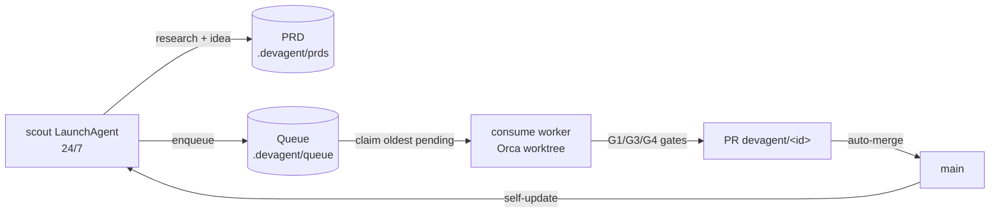

# Scout + Factory: 24/7 idea discovery and implementation

The self-build factory has two halves:



## Scout (FR-SCOUT-01)

One opencode process runs continuously, researching the product PRD
(`docs/PRD.md` sections 4+17), the run ledger, and lessons, then writes one
idea per cycle as a markdown PRD plus a queued task.

```bash
devagent scout --once --dry-run          # deterministic fallback task, no AI call
devagent scout --once                    # one live research cycle
devagent scout --interval 30             # daemon loop (used by LaunchAgent)
devagent scout-status                    # heartbeat age + queue depth
```

Artifacts per cycle:
- `.devagent/prds/<id>.md` - PRD markdown for the idea
- `.devagent/queue/<id>.json` - queued task (`pending`)
- `.devagent/scout.heartbeat.json` - last run time/status/detail

Failure policy: unparseable worker output or a missing binary falls back to a
deterministic task so the queue never starves. `maxQueued` (config) caps depth;
the scout skips enqueueing when the cap is reached.

## Factory bootstrap (FR-CREATE-01)

```bash
devagent create --repo . --dry-run       # print plan only
devagent create --repo . --scout --workers 2 --auto-merge --self-update
# Self-build factory (3 agents over this repo):
devagent create --repo . --scout --tracker --builder --auto-merge --self-update
```

Does, in order: ensure queue/prd dirs, merge `devagent.json`
(`scout.enabled`, `autoMerge`, `selfUpdate`), register the repo with Orca,
provision N Orca worktrees (`devagent-worker-1..N`), and on macOS install
up to three LaunchAgent plists (guarded for ephemeral tmp repos —
`shouldInstallLaunchAgent` refuses `tmpdir()` roots). Use `--dry-run` to
preview which plists would be written.

### Self-build factory roles (3 agents over this repo)

The factory can run as a **self-build team over this repo** (see
`docs/SELF-BUILD-LOOP.md`):

| Role | Command (loop) | Writes | LaunchAgent |
|---|---|---|---|
| PRD writer (opencode) | `devagent scout --interval 30` | PRD `.devagent/prds/<id>.md` + task `.devagent/queue/<id>.json` | `com.devagent.scout` |
| Progress tracker | `devagent track --interval 15` | `.selfbuild/progress.{md,json}` + `.devagent/tracker.heartbeat.json` | `com.devagent.tracker` |
| Builder (consume loop) | `scripts/build-loop.sh` / `consume --auto-pr --auto-merge` | PR `devagent/<id>` + `.selfbuild/ledger.jsonl` entry | `com.devagent.builder` |

Coordinator wiring: `devagent create --repo <repo> --scout --tracker --builder` creates all three plists
(`plutil -lint` clean) plus the Orca worktrees; `scripts/build-loop.sh` has its own
circuit-breaker + starvation gate and consumes the oldest `pending` task per iteration.
`devagent track` snapshots queue counts + scout heartbeat age + builder ledger tail +
recent commits + open PRs, so the tracker is shutdown-gap visible (`track` is
read-only; its failure never blocks the other two loops).

## Progress tracker (FR-TRACK-01)

```bash
devagent track                      # one-shot: gather queue+scout+ledger+git+gh -> .selfbuild/progress.md + heartbeat
devagent track --interval 15        # daemon: every 15m until SIGINT/SIGTERM
devagent track --json               # print the snapshot JSON instead of a summary line
```

Gathers the unified self-build snapshot (injectable runner, no secrets in logs):
queue by status (and up to `limit` recent tasks), scout heartbeat liveness
(stale threshold 6h — `alive` vs `stale` vs `no heartbeat yet`), builder ledger
tail (`ledger.jsonl` last N), recent commits (`git log --oneline`), and open PRs
(`gh pr list --json` best-effort). Writes `.selfbuild/progress.md` +
`.selfbuild/progress.json` and `.devagent/tracker.heartbeat.json`.

## Builder loop (scripts/build-loop.sh)

```bash
scripts/build-loop.sh                           # infinity: poll pending, consume one, record ledger, sleep
BUILDER_DRY_RUN=1 scripts/build-loop.sh &       # no consume, ledger dry_run:true per iteration
BUILDER_NO_MERGE=1 scripts/build-loop.sh         # --auto-pr only
BUILDER_POLL_SECS=60 BUILDER_MAX_FAILS=3 scripts/build-loop.sh
```

Env knobs: `BUILDER_REPO`, `BUILDER_MAX_FAILS` (circuit breaker, default 3),
`BUILDER_STARVATION` (halt when last N ledger entries non-productive, default 5),
`BUILDER_MAX_LOOPS` (per-task repair budget → `consume --max-loops`, default 2),
`BUILDER_POLL_SECS` (sleep when queue empty, default 300), `BUILDER_DRY_RUN`,
`BUILDER_NO_MERGE`. Records into `.selfbuild/ledger.jsonl` (`{"loop","ts","status","goal","dry_run"?,"pr"?}`).

## Workers (FR-WORKER-02)

```bash
devagent consume                # claim one pending task, run pipeline, no PR
devagent consume --auto-pr      # push branch + open PR when green
devagent consume --auto-pr --auto-merge
```

Claim order is FIFO on `pending`; the claim sets `claimedBy`/`claimedAt`.
The pipeline runs inside an isolated worktree (`.devagent-worktrees/<id>`,
branch `devagent/<id>`), then G1 test gate, G3 migration static gate, and G4
async-review gate must pass before publishing. Outcomes land back in the queue
file (`done` / `failed` + `lastError`).

## Auto-merge and self-update

`config.autoMerge` (or `--auto-merge`) merges green PRs via
`gh pr merge --auto --squash` (`src/integrations/github.ts: autoMergePr`).
After a published run, `config.selfUpdate` triggers `runSelfUpdate`
(`src/self-update.ts`): refuse on dirty tree, `git pull --ff-only`,
`npm ci|install`, `npm run build`, then `launchctl kickstart com.devagent.scout`.
Error details are redacted (`redactSecrets`) so tokens from git remotes never
reach logs. The same sequence is available as `scripts/self-update.sh <repo>`.

## macOS persistence

`devagent create --scout` writes
`~/Library/LaunchAgents/com.devagent.scout.plist` (`KeepAlive` + `RunAtLoad`)
and bootstraps it; with all three roles `create --scout --tracker --builder`
writes the corresponding triple:

- `com.devagent.scout` → `devagent scout --interval 30 --worker opencode`
- `com.devagent.tracker` → `devagent track --interval 15`
- `com.devagent.builder` → `bash scripts/build-loop.sh`

Each embeds the installing shell's PATH (launchd defaults are minimal) and sets
`WorkingDirectory` to the repo. Manage standalone:

```bash
scripts/install-scout-launchagent.sh --repo .            # install + start (scout only)
scripts/install-scout-launchagent.sh --validate          # plutil -lint only
scripts/install-scout-launchagent.sh --uninstall         # bootout + remove
```

Accepts `--interval`, `--worker`, and `--timeout` flags for the scout role; builder inherits `BUILDER_*` env.
Logs: `~/Library/Logs/devagent-scout.log`, `devagent-tracker.log`, `devagent-builder.log`.

## Queue operations

```bash
devagent queue list [--status pending] [--json]
devagent queue show <id>          # task fields + PRD head
```

Status model: `pending -> claimed -> done | failed`. `attempts` increments per
claim; failed tasks keep `lastError` for diagnosis.
