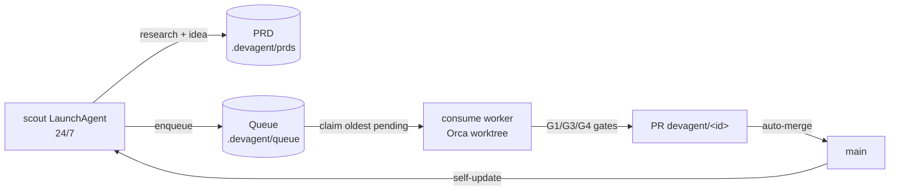

# Scout + Factory: 24/7 idea discovery and implementation

The self-build factory has two halves:



## Scout (FR-SCOUT-01)

One opencode process runs continuously, researching the product PRD
(`docs/PRD.md` sections 4+17), the run ledger, and lessons, then writes one
idea per cycle as a markdown PRD plus a queued task.

```bash
devagent scout --once --dry-run          # deterministic fallback task, no AI call
devagent scout --once                    # one live research cycle
devagent scout --interval 30             # daemon loop (used by LaunchAgent)
devagent scout-status                    # heartbeat age + queue depth
```

Artifacts per cycle:
- `.devagent/prds/<id>.md` - PRD markdown for the idea
- `.devagent/queue/<id>.json` - queued task (`pending`)
- `.devagent/scout.heartbeat.json` - last run time/status/detail

Failure policy: unparseable worker output or a missing binary falls back to a
deterministic task so the queue never starves. `maxQueued` (config) caps depth;
the scout skips enqueueing when the cap is reached.

## Factory bootstrap (FR-CREATE-01)

```bash
devagent create --repo . --dry-run       # print plan only
devagent create --repo . --scout --workers 2 --auto-merge --self-update
```

Does, in order: ensure queue/prd dirs, merge `devagent.json`
(`scout.enabled`, `autoMerge`, `selfUpdate`), register the repo with Orca,
provision N Orca worktrees (`devagent-worker-1..N`), and on macOS install the
scout LaunchAgent plist.

## Workers (FR-WORKER-02)

```bash
devagent consume                # claim one pending task, run pipeline, no PR
devagent consume --auto-pr      # push branch + open PR when green
devagent consume --auto-pr --auto-merge
```

Claim order is FIFO on `pending`; the claim sets `claimedBy`/`claimedAt`.
The pipeline runs inside an isolated worktree (`.devagent-worktrees/<id>`,
branch `devagent/<id>`), then G1 test gate, G3 migration static gate, and G4
async-review gate must pass before publishing. Outcomes land back in the queue
file (`done` / `failed` + `lastError`).

## Auto-merge and self-update

`config.autoMerge` (or `--auto-merge`) merges green PRs via
`gh pr merge --auto --squash` (`src/integrations/github.ts: autoMergePr`).
After a published run, `config.selfUpdate` triggers `runSelfUpdate`
(`src/self-update.ts`): refuse on dirty tree, `git pull --ff-only`,
`npm ci|install`, `npm run build`, then `launchctl kickstart com.devagent.scout`.
Error details are redacted (`redactSecrets`) so tokens from git remotes never
reach logs. The same sequence is available as `scripts/self-update.sh <repo>`.

## macOS persistence

`devagent create --scout` writes
`~/Library/LaunchAgents/com.devagent.scout.plist` (`KeepAlive` + `RunAtLoad`)
and bootstraps it. Manage it standalone:

```bash
scripts/install-scout-launchagent.sh --repo .            # install + start
scripts/install-scout-launchagent.sh --validate          # plutil -lint only
scripts/install-scout-launchagent.sh --uninstall         # bootout + remove
```

The plist embeds the installing shell's PATH (launchd defaults are minimal, so
worker binaries in user locations stay reachable) and accepts `--interval`,
`--worker`, and `--timeout` (per-cycle minutes, default 12) flags.

Logs: `~/Library/Logs/devagent-scout.log`.

## Queue operations

```bash
devagent queue list [--status pending] [--json]
devagent queue show <id>          # task fields + PRD head
```

Status model: `pending -> claimed -> done | failed`. `attempts` increments per
claim; failed tasks keep `lastError` for diagnosis.
